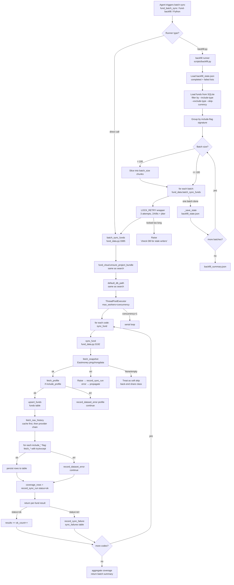

# Fund Batch Sync Pipeline

> **Last updated:** 2026-06-02
> **Source of truth:** `fund-data/scripts/backfill.py`,
> `fund-data/scripts/fund_data.py` (sync_fund / batch_sync_funds),
> `fund-data/scripts/fund_cloud.py` (bootstrap),
> `fund-data/AGENTS.md` (long-running recipes and pitfalls).
> **For:** OpenClaw / Codex / Claude Code agents and the humans who
> wire them up. The companion to
> [`fund-lookup-pipeline.md`](./fund-lookup-pipeline.md) (single-fund
> search) and [`fund-search-playbook.md`](./fund-search-playbook.md)
> (search answer script).

A batch sync in `fund-data` is **the same four layers as a single
search, plus a long-running runner on top** that owns state, batch
boundaries, and lock-retry. The layers, in order:

1. **Entry point** — `fund-batch-sync` console script, `fund_sync` /
   `fund_batch_sync` MCP tools, or direct `batch_sync_funds` import.
2. **Backfill runner** (optional) — `backfill.py` adds fund_type
   filtering, state persistence (`backfill_state.json`), batch
   grouping, and `database is locked` retry.
3. **Cloud bootstrap** — same as search: `ensure_project_bundle`
   decides which SQLite to read from / write to.
4. **DB path resolution** — same as search: `default_db_path()`
   collapses env vars and cache into one concrete file path.
5. **Batch scheduler** — `batch_sync_funds` runs N parallel
   `sync_fund` calls (or serial when concurrency=1).
6. **Per-fund sync pipeline** — `sync_fund` walks the capability
   ladder (snapshot → profile → fund row → NAV → optional
   datasets), persists each, and writes a `sync_runs` audit row.
7. **Provider chain** (per capability) — same shape as search, but
   each capability picks its own chain.

The diagrams below walk the layers in order, with code anchors and
the env vars that change behaviour at each step.

---

## 1. End-to-end flow (Mermaid)



## 2. End-to-end flow (ASCII fallback)

```
┌──────────────────────────────────────────────────────────────┐
│  Agent triggers batch sync (MCP / CLI / Python)               │
│  fund_batch_sync(codes=[...])                                 │
│  fund-backfill --include-type 股票型 --concurrency 8         │
│  fund_data.batch_sync_funds([...], include_all=True)         │
└────────────────────────┬─────────────────────────────────────┘
                         │
        ┌────────────────┴────────────────┐
        │  Runner type?                     │
        │  ├── backfill.py (state-managed) │
        │  └── direct batch_sync_funds      │
        └────────────────┬────────────────┘
                         │
   backfill.py path                              direct path
   ──────────────                                ───────────
   ①  load backfill_state.json                  fund_data.batch_sync_funds
       (completed_codes, failed_codes)               ↓
   ②  load funds from sqlite
       (filter by --include-type,
        --exclude-type, --skip-currency)
   ③  group codes by include-flag signature
   ④  for each group, slice into batch_size chunks
   ⑤  for each batch:                            │
       for attempt in 1..3:                      │
         try:                                    │
           batch_sync_funds(                     │
             batch, **flags,                     │
             db_path, provider,                  │
             concurrency,                        │
             min_interval_seconds,               │
             batch_id=backfill-<ts>-<idx>        │
           )                                     │
           break                                 │
         except OperationalError 'database       │
                is locked':                      │
           backoff = 2/4/8s + jitter             │
           sleep + retry                         │
         else: raise                             │
   ⑥  save_state after every batch              │
   ⑦  write backfill_summary.json at end        │
                         │                                 │
                         └────────────────┬────────────────┘
                                          │
                                          ▼
                     fund_cloud.ensure_project_bundle()
                     (identical to search; see pipeline.md §3.2)
                                          │
                                          ▼
                     default_db_path()
                     (identical to search; see pipeline.md §3.3)
                                          │
                                          ▼
                     batch_sync_funds() scheduler
                     ─────────────────────────
                     if concurrency <= 1: serial loop
                     else: ThreadPoolExecutor(max_workers=concurrency)

                     for each code:
                       _run(code) = sync_fund(code, **flags)
                                  ↓
                                  ▼
                     sync_fund(code, **flags) — the per-fund pipeline
                     ─────────────────────────────────────────────
                     ① fetch_snapshot     (Eastmoney pingzhongdata)
                        ok   → continue
                        None → soft skip (back-end share class)
                        err  → raise (record_sync_run error, propagate)
                     ② fetch_profile       (if include_profile)
                        err  → record_dataset_error, continue
                     ③ upsert_funds        (funds table by PK)
                     ④ fetch_nav_history   (cache first, then provider chain)
                     ⑤ for each include_* flag:
                          fetch_*(code, report_year, ...)
                          err → record_dataset_error, continue
                     ⑥ coverage_rows       (per-fund dataset summary)
                     ⑦ record_sync_run     (status=ok, rows_changed)
                                          │
                                          ▼
                     per-fund result
                     ───────────────────
                     status=ok  → ok_count++
                     status=err → record_sync_failure(sync_failures)
                                  ok_count++ if dataset_errors only
                                          │
                                          ▼
                     batch summary
                     ─────────────
                     {batch_id, total, ok, failed, concurrency,
                      min_interval_seconds, results, coverage}
```

---

## 3. The seven layers, in detail

### 3.1 Entry point

`fund-data` exposes three interchangeable surfaces that converge on
`fund_data.batch_sync_funds`:

| Surface | Code | What it does |
|---|---|---|
| MCP stdio | `fund-data/scripts/fund_mcp.py:222-243` | Tool `fund_batch_sync` with `codes: list[str]`, `concurrency`, `include_all`, `report_year`, etc. Returns `content[].text` (JSON) + `structuredContent` + `isError`. |
| MCP per-fund | `fund-data/scripts/fund_mcp.py:199-221` | Tool `fund_sync` with `code: str`. |
| Backfill CLI | `fund-data/scripts/backfill.py:415` | Console script `fund-backfill`. Adds state file, fund_type filter, batch grouping, lock retry. |
| Batch CLI | `fund-data/scripts/fund_cli.py` | `fund-cli batch-sync --codes-file ...` is a thin wrapper around `batch_sync_funds`. No state, no lock retry. |
| Python | `fund-data/scripts/fund_data.py:3385` | `fund_data.batch_sync_funds(codes, db_path=..., concurrency=...)`. |

The MCP path also calls `_maybe_bootstrap_cloud(arguments)` before
dispatching — same as `fund_search`. The backfill CLI does **not**
call the bootstrap (state management is local; the operator is
expected to have set `FUND_DATA_DB`).

### 3.2 Backfill runner — `scripts/backfill.py`

`fund-data/scripts/backfill.py:167-354` (`backfill()`)

Adds four concerns on top of `batch_sync_funds`:

1. **State persistence** (`backfill_state.json`):
   - `completed_codes` — successfully synced.
   - `failed_codes` — hard-failed (snapshot / NAV).
   - `last_batch_id`, `started_at`, `updated_at`, `totals`.
   - **Resume = restart with the same state file.** A run that
     crashed at batch 7 will pick up at batch 8 on the next
     invocation. Pass `--reset` to discard the state.
2. **Fund type filtering** (`_load_funds`):
   - `--include-type` / `--exclude-type` (repeatable substring
     match).
   - `--skip-currency` is the **default** for `include_all`
     because 货币 funds have no stock/bond/industry holdings —
     the calls return empty + a `dataset_errors` row. The flag
     cuts API call count by ~80 % on the currency subset.
3. **Batch grouping** (`_resolve_include_flags`):
   - Funds are grouped by their include-flag signature
     (`include_holdings`, `include_bonds`, ...). Currency funds
     get a different flag set from mixed funds. This is a
     micro-optimisation that lets `batch_sync_funds` pass
     the same flag dict to all funds in a group.
4. **Lock retry** (`LOCK_RETRY_ATTEMPTS = 3`):
   - Catches `sqlite3.OperationalError: database is locked`,
     sleeps `2/4/8s + jitter`, and retries the batch.
   - After 3 attempts, **aborts** with a "check the DB for stale
     writers" hint. A 9-second wait is cheaper than re-running
     a 6-hour backfill.

The runner is the right choice for any sync that touches more
than ~500 funds. Direct `batch_sync_funds` calls are fine for
on-demand watchlist pulls.

### 3.3 Cloud bootstrap — `fund_cloud.ensure_project_bundle()`

`fund-data/scripts/fund_cloud.py:543-609`

Identical to search. See [`fund-lookup-pipeline.md` §3.2](./fund-lookup-pipeline.md#32-cloud-bootstrap--fund_cloudensure_project_bundle).

**Backfill-specific caveat:** if the bootstrap returns
`source: "oss"` with the cache db, the writes will land in the
OSS cache, not the local `fund-data/data/fund_data.sqlite`. The
`doctor.py` report will then show stale numbers. Pick one:

```bash
# Run 1: use the local DB explicitly
export FUND_DATA_DB=/path/to/fund-data/data/fund_data.sqlite
fund-backfill --include-type 股票型 --concurrency 8

# Run 2: use the OSS cache (default behaviour) and accept the
# divergence from doctor.py
fund-backfill --include-type 股票型 --concurrency 8
```

The backfill CI workflow (`.github/workflows/sync.yml`) uses
`FUND_DATA_DB` explicitly. Local CLI runs without that var land
in the cache. **Always check `~/.cache/fund-data/current.json`
before a long pull.**

### 3.4 DB path resolution — `fund_data.default_db_path()`

`fund-data/scripts/fund_data.py:32-61`

Identical to search. See [`fund-lookup-pipeline.md` §3.3](./fund-lookup-pipeline.md#33-db-path-resolution--fund_datadefault_db_path).

### 3.5 Batch scheduler — `fund_data.batch_sync_funds()`

`fund-data/scripts/fund_data.py:3385-3512`

Two execution modes:

- **`concurrency <= 1`** (default for serial use): a `for code in
  code_list` loop, with a `stop_on_error` short-circuit.
- **`concurrency > 1`**: `ThreadPoolExecutor(max_workers=concurrency)`
  with `as_completed` for result collection. `stop_on_error`
  cancels pending futures and raises.

`min_interval_seconds` defaults:

- `0.25` when concurrency > 1 (the ThreadPool can fire 8 calls
  at once; the limiter throttles individual calls).
- `1.0` when concurrency = 1 (the serial loop runs one call at
  a time; the 1 RPS is the default for a single
  `FundDataClient`).

For Eastmoney-only runs, `batch_sync_funds` builds a custom
`FundDataClient` with a thread-safe `_RateLimiter` (line 693);
for other providers, each provider's own client handles its
own rate limit.

Each fund's result is either:

- `status: "ok"` with a per-dataset row count and a
  `dataset_errors` list (partial-failure is success).
- `status: "error"` with a `message` (hard failure, usually
  snapshot or NAV).

Hard failures land in `sync_failures` via
`store.record_sync_failure`. The backfill runner reads
`sync_failures` to populate its `failed_codes` list for the
state JSON, which means **`sync_failures` is the live queue
and `backfill_state.failed_codes` is a snapshot** — they can
diverge if you also run `retry_failures.py` between backfill
runs.

### 3.6 Per-fund pipeline — `fund_data.sync_fund()`

`fund-data/scripts/fund_data.py:3192-3382`

The capability ladder, in order:

| # | Step | What | Failure mode |
|---|---|---|---|
| 1 | `fetch_snapshot` | Eastmoney `pingzhongdata/{code}.js` | **Hard fail**: empty body → soft skip (back-end share class), parse error → raise |
| 2 | `fetch_profile` (if `include_profile`) | AkShare `fund_overview_em` / Tushare / Investoday | **Soft fail**: `record_dataset_error('profile', exc)`, continue |
| 3 | `upsert_funds` | Insert/update one row in `funds` by `fund_code` PK | Hard fail if the SQL itself fails (rare) |
| 4 | `fetch_nav_history` | OSS/local `nav_history` cache, then provider chain on miss/stale | **Hard fail**: cache miss/stale plus provider failure is the second hard-fail step |
| 5 | `fetch_stock_holdings` (if `include_holdings`) | AkShare `fund_portfolio_hold_em` | Soft fail |
| 6 | `fetch_bond_holdings` (if `include_bonds`) | AkShare `fund_portfolio_bond_hold_em` | Soft fail |
| 7 | `fetch_industry_allocations` (if `include_industries`) | AkShare `fund_portfolio_industry_allocation_em` | Soft fail |
| 8 | `fetch_fee_structures` (if `include_fees`) | AkShare fee aliases + Eastmoney page fallback | Soft fail |
| 9 | `fetch_dividends` (if `include_distributions`) | AkShare `fund_open_fund_info_em` (分红送配) | Soft fail |
| 10 | `fetch_splits` (if `include_distributions`) | AkShare `fund_open_fund_info_em` (拆分详情) | Soft fail |
| 11 | `fetch_fund_managers` (if `include_managers`) | AkShare `fund_manager_em` | Soft fail |
| 12 | `coverage_rows` | Per-fund dataset summary | Pure read |
| 13 | `record_sync_run` | Audit row in `sync_runs` | Write side effect |

**The two hard-fail steps** are `fetch_snapshot` and
`fetch_nav_history`. If either raises, `sync_fund` writes
`status: "error"` to `sync_runs` and re-raises. Everything
else is best-effort.

**The "soft fail" semantic is `dataset_errors`, not silent
success.** The result dict carries a `dataset_errors` list,
and the backfill runner prints it. An agent should treat
`status: "ok"` + `len(dataset_errors) > 0` as "partial".

**`fund_count` is the upsert result for the `funds` row.**
The `_fund_row_from_sync` helper (line 3169) builds that row
from `profile` (preferred) or `snapshot` (fallback). The
fund_name, fund_type, company, and manager columns come
from there — that is why `fetch_profile` must run before
`upsert_funds` if you care about those columns.

### 3.7 Provider chain (per capability)

`fund-data/scripts/fund_data.py:1955-2011`

Same shape as search. See [`fund-lookup-pipeline.md` §3.4](./fund-lookup-pipeline.md#34-provider-chain--build_providers_full--run_provider_chain).

Backfill-specific notes:

- **`--provider eastmoney --concurrency 8`** is the fastest
  full-coverage path for snapshot + NAV (~90 min for 26k
  funds, 95 % success). 0.36 s/fund.
- **`--provider akshare`** is currently unusable for
  full-coverage backfill (limit batch to 50, expect 30 %
  failure). Use only for small targeted pulls.
- **`--provider tushare`** with `TUSHARE_TOKEN` covers the
  AkShare-only capabilities at ~200 calls/min. Use as the
  second pass after an Eastmoney snapshot+NAV pass.
- **`--provider investoday`** is the long-term fix: set
  `INVESTODAY_API_KEY` and `auto` mode will put Investoday
  first for every capability. ¥45 基础包 unlocks the L2
  portfolio-* set.

### 3.8 Persistence (the side effects)

Three tables get written:

1. **Per-fund data tables** — `funds`, `nav_history`, `snapshots`,
   `fund_profiles`, `stock_holdings`, `bond_holdings`,
   `industry_allocations`, `fee_structures`, `dividends`,
   `splits`, `fund_managers`. Each `fetch_*` upserts via
   `FundDataStore.upsert_*` (PK on `fund_code` /
   `(fund_code, report_period, ...)`).
2. **`sync_runs`** — one row per `sync_fund` call (status
   `ok` / `error`, rows_changed, started_at, message).
3. **`sync_failures`** — one row per hard-failed `sync_fund`
   call. Backed by `record_sync_failure`.

**`raw_responses`** gets written by every `fetch_*` call as a
side effect. This is the audit log for what the provider
actually returned. It can be large (full HTTP bodies) and
is the source of the IP-leak risk in `--include-data` skill
installs (see [`fund-search-playbook.md` Q8](./fund-search-playbook.md)).

---

## 4. Decision points an agent should know

| Question | Default | Override | What changes |
|---|---|---|---|
| Which DB? | `default_db_path()` (OSS cache if pulled, else local) | `FUND_DATA_DB=/abs/path/fund_data.sqlite` | Backfill writes go to the explicit DB. |
| Should I bootstrap OSS? | Yes (for MCP / direct CLI) | `FUND_DATA_AUTO_PULL=0` (or unset `FUND_DATA_DB` + state-managed runner) | The backfill CI workflow uses `FUND_DATA_DB` explicitly. |
| State resume or fresh start? | Resume from `backfill_state.json` | `--reset` | Discards the state file. |
| Which funds? | All in `funds` table | `--include-type` / `--exclude-type` / `--max-funds` | Substring match on `fund_type` (e.g. `--exclude-type 货币`). |
| Currency fund datasets? | Skip optional (saves ~80 % calls) | `--no-skip-currency` | Currency funds return empty for holdings/fees anyway. |
| Concurrency? | 8 (per the AGENTS.md sweet spot) | `--concurrency N` | 16 does not speed up AkShare; Eastmoney tolerates more. |
| Batch size? | 500 (`backfill.py`) / 100 (per AGENTS.md recommendation) | `--batch-size N` | 200+ batches can take 5-8 min; a transient failure loses the whole batch. |
| Min interval? | 0.25 s (concurrent) / 1.0 s (serial) | `--min-interval-seconds` | Eastmoney throttles beyond ~2-3 RPS. |
| Snapshot failed? | Hard fail, fund moves to `failed_codes` | `parse_snapshot` returns `None` for empty pages (back-end share class) — not a hard fail | 241 funds were sitting in `sync_failures` before this fix. |
| NAV failed? | Hard fail | (no override) | NAV is the data anchor for everything else. |
| Optional dataset failed? | `record_dataset_error`, fund stays in `ok` | (no override) | `sync_failures` is **not** the queue for this. |
| Provider? | auto (Eastmoney → AkShare) | `--provider {eastmoney,akshare,investoday,tushare}` | Tushare/Investoday are inserted first if their env vars are set. |
| Lock retry? | 3 attempts, 2/4/8s + jitter | `LOCK_RETRY_ATTEMPTS` / `LOCK_RETRY_BASE_SECONDS` (source) | Only `backfill.py` has the retry; direct `batch_sync_funds` does not. |
| Stop on first error? | No (continue, record failure) | `stop_on_error=True` (Python) | Rarely useful; backfill prefers continue + retry. |

---

## 5. Common agent misuses

1. **Looping `fund_sync` for batch work.** Each call spawns the
   full cloud bootstrap. Use `fund_batch_sync` (one bootstrap,
   N funds) or `fund-backfill` (state-managed).

2. **Re-running `batch_sync` after a network blip without
   re-checking the state file.** The state file is the
   resume mechanism. If you restart with `--reset`, you
   re-do 19k of completed work.

3. **Forgetting `--exclude-type 货币`.** 975 currency funds
   × 5 empty datasets × 2-3 s per call = 2.5-4 hours of
   wasted rate-limit budget. The default `--skip-currency`
   already protects against this for `include_all`, but
   if you pass explicit `include_*` flags the backfill
   layer's `_resolve_include_flags` is bypassed.

4. **Treating `dataset_errors` as failed funds.** A fund
   with `status: "ok"` and `dataset_errors: [profile, fees]`
   is a partial success. The fund moved on and the
   coverage will show the gap. Re-run with a different
   provider if the gap is unacceptable; do not retry the
   same code blindly.

5. **Retrying the 380 `sync_failures` from snapshots.**
   These are all `eastmoney: fund code must contain 6
   digits: ''` + `akshare: 'AkshareProvider' object has
   no attribute 'snapshot'`. Neither will ever succeed —
   the 380 funds are real (mostly REITs and QDII
   variants) and they simply don't have snapshot data
   in any current provider. Wait for
   `feat(akshare): add AkshareProvider.snapshot`
   to land.

6. **Not running `refresh_fund_type --only-empty` after
   a `list` rebuild.** `upsert_funds` will overwrite
   `fund_type` with whatever the latest provider
   returned, which is often blank. Coverage reports
   and fund_type filters will misfire.

7. **Hiding `sync_failures` in CI.** A nightly backfill
   that runs to "ok=26000, failed=380" is reporting
   real API surface gaps. Pin them in a known-issues
   doc; do not silence them.

8. **Running the backfill over the OSS cache DB without
   knowing it.** The default `default_db_path()` prefers
   the cache over `FUND_DATA_DB` if `FUND_DATA_DB` is
   unset and the cache is pulled. Long writes go to the
   cache, `doctor.py` reports the on-disk DB, and an
   on-call human gets paged for a "missing data" alert
   that is actually a path mismatch.

9. **Trying to backfill 27k funds in one `batch_sync_funds`
   call.** The ThreadPoolExecutor does not checkpoint.
   If the process dies at fund 26000, the next call
   re-does 0-25999. Use `backfill.py` (with state) or
   slice into 1000-fund chunks.

10. **Trusting `backfill_state.failed_codes` as the source
    of truth.** That field is a snapshot; the live queue
    is `sync_failures`. `retry_failures.py` reads
    `sync_failures` and writes back; `backfill.py` reads
    `backfill_state.failed_codes` and skips them. If you
    run them interleaved, the state file and the table
    will drift.

11. **Running backfill on macOS without patching `urllib` +
    `getaddrinfo`.** The macOS three-layer proxy and
    IPv6 happy-eyeballs will silently route your HTTP
    through Clash Verge and deadlock on the IPv6 SYN.
    See the long-running pitfalls in
    [`fund-data/AGENTS.md`](../../fund-data/AGENTS.md).

---

## 6. Typical run profiles

### 6.1 Nightly full backfill (CI / cron)

```bash
export FUND_DATA_DB=/path/to/fund-data/data/fund_data.sqlite
.venv-akshare/bin/python3 fund-data/scripts/backfill.py \
  --concurrency 8 \
  --batch-size 100 \
  --exclude-type 货币 \
  --report-year $(date +%Y) \
  --nav-years 5 \
  --reset
```

- `--reset` because the nightly workflow runs to completion;
  a partial resume across nightly invocations would
  accumulate `failed_codes` that are just transient blips.
- The output is `backfill_summary.json`; pipe it into a
  coverage diff or alert.

### 6.2 Watchlist pull (developer / agent on demand)

```bash
fund-cli batch-sync --codes-file fund-data/data/fund_codes_sample.txt \
  --include-all --report-year 2024 --concurrency 4
```

- No state file; if it fails, re-run with the same file.
- `concurrency 4` is conservative; the public endpoints
  throttle at 8+.

### 6.3 Per-fund follow-up (agent self-service)

```bash
fund-cli sync 110022 \
  --start-date 2024-01-01 --end-date 2024-12-31 \
  --include-holdings --include-fees \
  --report-year 2024 --fee-indicator 申购费率
```

- The cheapest path. One fund, one round trip per dataset.
- Idempotent — re-running is a no-op (rows are upserted).

### 6.4 Two-pass full coverage (production-grade)

```bash
# Pass 1: Eastmoney snapshot + NAV (~90 min)
.venv-akshare/bin/python3 fund-data/scripts/backfill.py \
  --provider eastmoney --concurrency 8 --batch-size 100 \
  --report-year $(date +%Y) --reset

# Pass 2: Tushare (or Investoday) for the rest (~3-4 hours)
export TUSHARE_TOKEN=...
.venv-akshare/bin/python3 fund-data/scripts/backfill.py \
  --provider tushare --concurrency 4 --batch-size 50 \
  --report-year $(date +%Y) --no-skip-currency
```

- Pass 2 re-runs the full universe but only the
  AkShare-only capabilities (profile, holdings, etc.)
  change — snapshot and NAV are idempotent.
- `--no-skip-currency` on pass 2 is acceptable because
  the rate-limit budget is now on Tushare, not AkShare.

### 6.5 OpenClaw long-running agent (daemon)

```json
{
  "mcpServers": {
    "fund-data": {
      "command": "/path/to/fundData/.venv-akshare/bin/python",
      "args": ["/path/to/fundData/fund-data/scripts/fund_mcp.py"],
      "env": {
        "FUND_DATA_DB": "/var/lib/fund-data/fund_data.sqlite",
        "FUND_DATA_AUTO_PULL": "1",
        "PYTHONUNBUFFERED": "1"
      }
    }
  }
}
```

- `PYTHONUNBUFFERED=1` so log lines stream (Python stdout
  is fully buffered when not on a TTY).
- `FUND_DATA_DB` pinned to a stable path so daemon restarts
  write to the same DB; do not rely on the cache.

---

## 7. Known gaps

Tracked in [`README.md` §Known gaps](../../README.md#known-gaps-tracked-for-030):

- **No `--json` global flag on `fund_cli.py`** (backlog v0.3.0).
  `batch-sync` / `backfill` pretty-print the per-batch summary
  for humans; an agent that wants structured output has to
  parse the log or read `backfill_summary.json` directly.
- **No progress notifications on `fund_batch_sync` MCP tool.**
  The MCP server is stdio-only and the tool returns only
  when the whole batch is done. A 1000-fund batch with
  `concurrency 4` can take 5-10 minutes of silence.
- **No `--dry-run` on `fund-batch-sync`.** There is
  `--max-funds N` and `--include-type 股票型` for a quick
  smoke test, but no way to predict the per-fund dataset
  fan-out without actually running.
- **No HTTP / SSE MCP transport.** Stdio only. Daemon
  agents must run the MCP server in-process.
- **No `fund_doctor` / `fund_provider_status` MCP tool.**
  Agents cannot self-diagnose the environment from MCP.
- **`backfill_state.failed_codes` and `sync_failures` table
  drift** when both `backfill.py` and `retry_failures.py`
  run interleaved. The team tracks this as a known ops
  gotcha, not a bug.

Other items tracked in `fund-data/AGENTS.md`:

- **`AkshareProvider.snapshot` is missing** → 380
  `sync_failures` on snapshot calls. Land the
  `feat(akshare): add AkshareProvider.snapshot` PR
  to close it.
- **`_merge_separate_db` schema drift** on
  `akshare_capability_backfill.py --separate-db` →
  `NOT NULL constraint failed: industry_allocations.fetched_at`.
  Track under
  `fix(akshare): use explicit column lists in _merge_separate_db`.

---

## 8. Code anchors (cheat-sheet)

| Step | File:line |
|---|---|
| `fund_sync` MCP tool definition | `fund-data/scripts/fund_mcp.py:199` |
| `fund_batch_sync` MCP tool definition | `fund-data/scripts/fund_mcp.py:222` |
| `fund-cli batch-sync` subcommand | `fund-data/scripts/fund_cli.py` (search inside) |
| `backfill` runner | `fund-data/scripts/backfill.py:167` |
| `backfill._load_funds` (fund_type filter) | `fund-data/scripts/backfill.py:76` |
| `backfill._resolve_include_flags` (currency skip) | `fund-data/scripts/backfill.py:103` |
| `backfill._load_state` / `_save_state` | `fund-data/scripts/backfill.py:148-164` |
| `backfill` lock retry | `fund-data/scripts/backfill.py:266-306` |
| `backfill.main` | `fund-data/scripts/backfill.py:415` |
| `batch_sync_funds` | `fund-data/scripts/fund_data.py:3385` |
| `sync_fund` | `fund-data/scripts/fund_data.py:3192` |
| `_fund_row_from_sync` | `fund-data/scripts/fund_data.py:3169` |
| `fund_cloud.ensure_project_bundle` | `fund-data/scripts/fund_cloud.py:543` |
| `default_db_path` | `fund-data/scripts/fund_data.py:32` |
| `build_providers_full` | `fund-data/scripts/fund_data.py:1955` |
| `run_provider_chain` | `fund-data/scripts/fund_data.py:609` |
| `_RateLimiter` (thread-safe) | `fund-data/scripts/fund_data.py:693` |
| `FundDataStore.record_sync_run` | `fund-data/scripts/fund_data.py:2634` |
| `FundDataStore.record_sync_failure` | `fund-data/scripts/fund_data.py:2654` |
| `refresh_fund_type` script | `fund-data/scripts/refresh_fund_type.py` |
| `akshare_capability_backfill` script | `fund-data/scripts/akshare_capability_backfill.py` |
| `retry_failures` script | `fund-data/scripts/retry_failures.py` |
| `doctor.py` (CI gate) | `fund-data/scripts/doctor.py` |
| Long-running pitfalls (macOS / proxy / IPv6) | `fund-data/AGENTS.md` |
| Provider ordering benchmark | `fund-data/AGENTS.md` (Eastmoney-only beats AkShare 8x) |
| Coverage diagnostics (2026-06-02) | `docs/superpowers/specs/2026-06-02-fund-data-completeness-diagnosis.md` |

---

## 9. Maintenance

When you change any of the following, this document is stale:

- `backfill.py` defaults (`DEFAULT_CONCURRENCY`,
  `DEFAULT_BATCH_SIZE`, `LOCK_RETRY_ATTEMPTS`).
- `backfill._resolve_include_flags` flag set.
- `sync_fund` capability ladder (new fetch added or
  reordered).
- The hard-fail / soft-fail classification of any
  capability in `sync_fund`.
- The provider chain ordering for any capability.
- New env var that affects batch sync (e.g. a new
  `--proxy-bypass` knob).

Open a PR with the diagram update alongside the code
change. The Mermaid block is the contract; the ASCII
block is the verification target. If they disagree,
ASCII wins.
