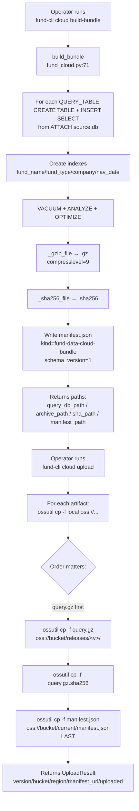
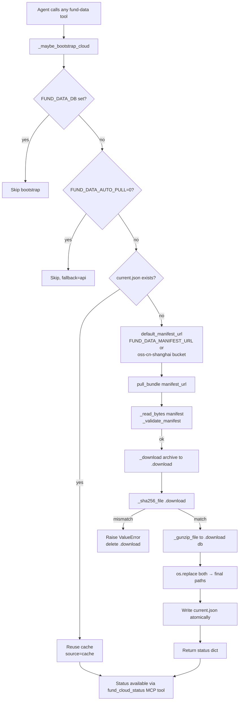

# Fund Cloud Bundle Pipeline

> **Last updated:** 2026-06-02
> **Source of truth:** `fund-data/scripts/fund_cloud.py` (734 lines,
> dependency-light — stdlib + the in-tree `fund_data`), the
> `fund-cli cloud` subcommands in
> `fund-data/scripts/fund_cli.py`.
> **For:** Anyone — human or AI — who needs to understand how the
> OSS query bundle is built, uploaded, pulled, and consumed. The
> companion to [`fund-lookup-pipeline.md`](./fund-lookup-pipeline.md)
> §3.2 (which is the in-process view of the bootstrap) and
> [`fund-batch-sync-pipeline.md`](./fund-batch-sync-pipeline.md)
> (which is the data-plane view of where the bundle ends up).

The cloud bundle is the **distribution path** for `fund-data`:
it is how a fresh OpenClaw daemon gets a 27k-fund SQLite
without running a 21-hour AkShare backfill on first install.
This document covers the four subcommands (`build-bundle`,
`archive-full`, `pull`, `upload`, `status`), the file layout on
OSS, the sha256 verification, the `current.json` pointer, and
the failure modes the team has had to design around.

---

## 1. End-to-end flow (Mermaid)

### 1.1 Publish side (operator / CI)



### 1.2 Consume side (agent / daemon)



## 2. End-to-end flow (ASCII fallback)

### 2.1 Publish

```
┌──────────────────────────────────────────────────────────────┐
│  Operator / CI: publish a query bundle                       │
│  $ fund-cli cloud build-bundle \                             │
│      --source-db fund-data/data/fund_data.sqlite \           │
│      --output-dir dist/releases/2026-06-02 \                 │
│      --base-url https://...aliyuncs.com/fund-data/releases/  │
│      --version 2026-06-02 \                                  │
│      --manifest-output dist/current/manifest.json            │
└────────────────────────┬─────────────────────────────────────┘
                         │
                         ▼
build_bundle() — fund_cloud.py:71
───────────────────────────────
  ① open source.sqlite, capture CREATE TABLE SQL for QUERY_TABLES
  ② open query.sqlite, pragma journal_mode=OFF / synchronous=OFF / temp_store=MEMORY
  ③ attach source.sqlite, for each table:
       CREATE TABLE query.<t>  (from sqlite_master.sql)
       INSERT INTO query.<t> SELECT * FROM source.<t>
       record row count
  ④ create query indexes:
       funds(fund_name, fund_type, company)
       nav_history(nav_date)
       fund_profiles(fund_company)
       fund_managers(current_fund_codes)
  ⑤ analyze + optimize + vacuum
  ⑥ detach source
  ⑦ _gzip_file(query.sqlite → query.sqlite.gz, compresslevel=9)
  ⑧ _sha256_file(.gz) → digest
  ⑨ write .sha256 sidecar
  ⑩ write manifest.json:
       kind: "fund-data-cloud-bundle"
       version: <YYYY-MM-DD>
       schema_version: 1
       files.query_db: { path, url, sha256, size_bytes, compression: "gzip" }
       tables: { <table>: <row_count>, ... }
       excluded_tables: [raw_responses, sync_runs, sync_failures]
  ⑪ return { manifest, paths }

                          ↓  (operator runs separately)

┌──────────────────────────────────────────────────────────────┐
│  $ fund-cli cloud upload \                                   │
│      --release-dir dist/releases/2026-06-02 \                │
│      --manifest dist/current/manifest.json \                 │
│      --output dist/current/upload.json                       │
└────────────────────────┬─────────────────────────────────────┘
                         │
                         ▼
upload_to_oss() — fund_cloud.py:633
───────────────────────────────
  for each artifact in [query.gz, query.gz.sha256, manifest.json]:
    ossutil cp -f local oss://fund-data-public-l/fund-data/releases/<v>/
  manifest is uploaded last to {prefix}/current/manifest.json
  ossutil cp -f always — silent skip on existing keys without -f
  return UploadResult { version, bucket, region, prefix,
                         manifest_url, uploaded, dry_run }
```

### 2.2 Consume

```
┌──────────────────────────────────────────────────────────────┐
│  Agent: any tool call without explicit `db`                 │
│  fund_search / fund_sync / fund_export / ...                │
└────────────────────────┬─────────────────────────────────────┘
                         │
                         ▼
_maybe_bootstrap_cloud(arguments) — fund_mcp.py:380
─────────────────────────────────────────────────
  if "db" in arguments: return   (agent pinned an explicit DB)

ensure_project_bundle() — fund_cloud.py:543
─────────────────────────────────────────
  ① FUND_DATA_DB set?  → SKIP, "FUND_DATA_DB is set"
  ② FUND_DATA_AUTO_PULL=0?  → SKIP, fallback=api
  ③ current.json present and db_path.is_file?
        → reuse cache, source=cache
  ④ else:
        url = FUND_DATA_MANIFEST_URL or default_manifest_url()
        try pull_bundle(url, cache_dir)
          except: return fallback=api, error=str(exc)

pull_bundle(manifest_url, cache_dir) — fund_cloud.py:200
────────────────────────────────────────────────────────
  ① _read_bytes(manifest_url) → JSON
  ② _validate_manifest: kind / version / schema_version / files.query_db.{sha256,url|path}
  ③ derive archive_url:
        file_info.url  if set
        else: urljoin(_manifest_base_url(manifest_url), file_info.path)
  ④ mkdir cache_dir/releases/<safe_version>/
  ⑤ _download(archive_url, archive_path.download)
  ⑥ _sha256_file(archive.download) == expected
        mismatch → unlink .download, raise ValueError
  ⑦ _gunzip_file(archive.download, db_path.download)
  ⑧ os.replace(archive.download → archive_path)   # atomic
  ⑨ os.replace(db.download → db_path)               # atomic
  ⑩ write current.json atomically:
        version / schema_version / installed_at / manifest_url
        manifest / db_path / archive_path / sha256 / sizes
  ⑪ return status(cache_dir)

status(cache_dir, manifest_url=None) — fund_cloud.py:250
───────────────────────────────────────────────────────
  if not current.json:
     { installed: False, cache_dir, db_path: None, version: None }
     [if manifest_url]: merge _remote_status(manifest_url)
  else:
     read current.json, compute installed = db_path.is_file()
     return { installed, cache_dir, version, schema_version,
              installed_at, manifest_url, db_path, sha256, sizes }
     [if manifest_url]: merge _remote_status(manifest_url),
                        compute update_available
```

---

## 3. The seven layers, in detail

### 3.1 File layout

The bundle is a three-file triplet that lives at
`oss://<bucket>/<prefix>/releases/<version>/`:

| File | Purpose | Size (typical) |
|---|---|---|
| `fund_data_query.sqlite` | Uncompressed SQLite, query tables only | ~2-3 GB |
| `fund_data_query.sqlite.gz` | gzip -9 of the above | ~600-900 MB |
| `fund_data_query.sqlite.gz.sha256` | Digest of the .gz | 64 B + filename |

A `manifest.json` describes all three:

```json
{
  "kind": "fund-data-cloud-bundle",
  "version": "2026-06-02",
  "schema_version": 1,
  "updated_at": "2026-06-02T03:00:00+00:00",
  "files": {
    "query_db": {
      "path": "fund_data_query.sqlite.gz",
      "url": "https://...aliyuncs.com/fund-data/releases/2026-06-02/fund_data_query.sqlite.gz",
      "sha256": "abc123...",
      "size_bytes": 723456789,
      "uncompressed_size_bytes": 2147483648,
      "compression": "gzip"
    }
  },
  "tables": {
    "funds": 26936, "nav_history": 509019, ...
  },
  "excluded_tables": ["raw_responses", "sync_runs", "sync_failures"]
}
```

The manifest at `current/manifest.json` is the "latest"
pointer; consumers always read this one first. The
versioned manifests live alongside their release files for
auditability.

### 3.2 Tables: included vs excluded

`fund-data/scripts/fund_cloud.py:27-44`

The query bundle is **the 11 data tables** that the agent
needs at runtime:

```
funds, nav_history, snapshots, stock_holdings, fund_profiles,
bond_holdings, industry_allocations, fee_structures, dividends,
splits, fund_managers
```

It excludes the **3 audit tables** that are operator-only:

```
raw_responses    (full upstream HTTP bodies; may contain caller IP)
sync_runs        (every sync call's audit row)
sync_failures    (every hard-failed sync call's queue row)
```

The exclusion list is the privacy boundary. `raw_responses`
is the source of the `--include-data` skill install's
`--scrub-raw-responses` flag (see
[`fund-search-playbook.md` Q8](./fund-search-playbook.md)).
`sync_runs` and `sync_failures` are operator telemetry that
is meaningless to an agent on a different machine.

If the team ever adds a new audit table, the exclusion
list must be updated in lockstep — otherwise a
`--include-data` install of the query bundle will leak the
new table to the public bucket.

### 3.3 Build: `build_bundle` and `_build_query_database`

`fund-data/scripts/fund_cloud.py:71-129` (entry point)
`fund-data/scripts/fund_cloud.py:302-332` (the SQL)

The build is a **clean, deterministic SQLite-to-SQLite
copy** with these properties:

- **`ATTACH` + `INSERT ... SELECT`** instead of `INSERT OR
  REPLACE` from a Python loop. This is the only way to
  copy ~2.5 GB of 11 tables in a few minutes; a Python
  loop would take an hour and a half.
- **`pragma journal_mode = OFF` / `synchronous = OFF` /
  `temp_store = MEMORY`** on the destination. The build
  is a one-shot copy; durability is not needed (the
  source is the canonical DB). These pragmas trade
  durability for speed.
- **Index creation is explicit** (`_create_query_indexes`).
  The query DB has different read patterns than the
  source: agents filter by `fund_name`, `fund_type`, and
  `company`; backfill joins by `nav_date` and
  `current_fund_codes`. The indexes match the agent
  workload.
- **`VACUUM` at the end** reclaims the half-empty pages
  that `INSERT ... SELECT` leaves. Without it the .gz
  would be ~30 % larger.
- **The `tables` field in the manifest** records the
  final row count per table. An agent can use this to
  budget "is this bundle as fresh as the source?" before
  downloading the .gz.

### 3.4 Pull: `pull_bundle` and the verification chain

`fund-data/scripts/fund_cloud.py:200-247`

The pull is a **trust chain** with three verification
points:

1. **Manifest signature** — `_validate_manifest` checks
   `kind`, `version`, `schema_version`, and the
   `files.query_db.{sha256,url|path}` shape. A bad
   manifest is rejected before any download.
2. **URL provenance** — the manifest is fetched over
   HTTPS with a custom User-Agent. The archive URL is
   derived from the manifest's `url` field, or computed
   from the manifest URL's base + the file path. An
   attacker that can serve a malicious manifest can
   redirect the download, but cannot bypass the next
   check.
3. **SHA-256 verification** — `_sha256_file` on the
   downloaded .gz is compared to the manifest's
   `sha256` field. A mismatch raises `ValueError` and
   deletes the partial download. This is the
   tamper-evidence guarantee.

The download itself uses **two-phase atomic writes**:
`.download` files for both the .gz and the .db, then
`os.replace` to the final paths. A crash mid-download
leaves `.download` files that the next pull overwrites.

`current.json` is the **single source of truth** for
"what version is on this machine". It is written
atomically via `_write_json_atomic` (write `.tmp`, then
`os.replace`).

### 3.5 Upload: `upload_to_oss` and the `ossutil cp -f` rule

`fund-data/scripts/fund_cloud.py:612-734`

The upload is a **shelled-out `ossutil cp -f`** call, not
a Python HTTP client. The reasons:

- **The agent environment already has `ossutil` on PATH**
  with a configured `~/.ossutilconfig`. No new Python
  dependency, no per-machine bootstrap.
- **The same command works from cron, GitHub Actions,
  and a developer laptop.** No platform-specific code
  in the project.
- **`-f` is required** — without it, `ossutil cp` prompts
  "y or N" on existing keys, which hangs the
  non-interactive shell. The script passes `-f`
  unconditionally; the team has documented this in
  AGENTS.md after multiple "upload says success but
  nothing changed" incidents.

The upload order matters:

1. `query.gz` first — the largest file, the one that
   the pull actually needs.
2. `query.gz.sha256` second — the verification artifact.
3. `manifest.json` **last** — the consumer-facing
   pointer. A consumer that polls `current/manifest.json`
   should never see a half-published release: either
   the manifest points to the previous version (no
   change) or to the new version (everything is
   already there). If `manifest.json` is uploaded
   before `query.gz`, a consumer in between would
   download a `query.gz` that does not exist.

### 3.6 Status: `status` and `_remote_status`

`fund-data/scripts/fund_cloud.py:250-287`
`fund-data/scripts/fund_cloud.py:398-408`

The status tool reports **three views of the world**:

- **Local cache** — what is installed at
  `~/.cache/fund-data/current.json`?
  Version, schema_version, installed_at, manifest_url,
  db_path, sha256, sizes.
- **Remote manifest** (if `manifest_url` passed) — what
  is the latest published version? remote_version,
  remote_updated_at, remote_query_db_size_bytes,
  remote_query_db_sha256.
- **Comparison** — `update_available: bool` is `true` if
  `remote_version != local.version`. A pull is needed.

The MCP `fund_cloud_status` tool is a thin wrapper
around this; it accepts optional `cache_dir` and
`manifest_url` arguments. The tool is the agent's
window into "is the bundle I'm using current?" without
having to actually pull.

### 3.7 Cache layout

```
~/.cache/fund-data/                # or $FUND_DATA_CACHE_DIR
├── current.json                   # the version pointer
└── releases/
    └── 2026-06-02/                # $FUND_DATA_CACHE_DIR/releases/<safe_version>/
        ├── fund_data_query.sqlite
        ├── fund_data_query.sqlite.gz
        └── fund_data_query.sqlite.gz.sha256
```

`_safe_version` (`fund_cloud.py:468-469`) replaces any
non-alphanumeric character with `-` and falls back to
`"current"` if the result is empty. A version like
`2026-06-02-130900` becomes `2026-06-02-130900`; a
version like `v1.0+local` becomes `v1.0-local`.

`current.json` is the file that `default_db_path()` reads
to decide where the agent's DB is. It is **the
authoritative local pointer** — every cache state
transition rewrites it atomically.

---

## 4. Decision points an agent should know

| Question | Default | Override | What changes |
|---|---|---|---|
| Which cache dir? | `~/.cache/fund-data` | `FUND_DATA_CACHE_DIR=/var/cache/fund-data` | Used by every `fund_cloud.*` call. |
| Which manifest URL? | `https://fund-data-public-l.oss-cn-shanghai.aliyuncs.com/fund-data/current/manifest.json` | `FUND_DATA_MANIFEST_URL=https://...` | The pull source. |
| Should I bootstrap? | Yes (for MCP / direct CLI) | `FUND_DATA_AUTO_PULL=0` | Bootstrap returns `fallback: "api"`. |
| Which bucket / region / prefix? | `fund-data-public-l` / `cn-shanghai` / `fund-data` | `fund-cli cloud upload --bucket --region --prefix` | Used by `cloud upload` only. |
| Is the upload dry-run? | No (real `ossutil cp -f`) | `--dry-run` | Prints the ossutil commands without executing. |
| Should the install include raw_responses? | No (excluded from query bundle) | `--include-data` on `install_skill.py` | Independent of the bundle; install-side scrub. |
| Should I re-pull? | `cloud pull` re-checks manifest | Manual `cloud status --manifest-url ...` first | `update_available: true` means a new version exists. |
| Which OSS subcommand? | `cloud build-bundle` + `cloud upload` | `cloud archive-full` (for private full DB) | Query bundle is public; full archive is private. |

---

## 5. Common agent misuses

1. **Calling `cloud build-bundle` without `--source-db`.**
   The build reads the full source SQLite; passing the
   wrong path gives you a bundle of the wrong DB. Always
   pass `--source-db fund-data/data/fund_data.sqlite`
   explicitly.

2. **Forgetting `-f` on `ossutil cp`.** Without `-f`,
   `ossutil` prompts "y or N" on existing keys. In a
   non-interactive shell, the prompt is invisible and
   the upload silently no-ops (or partially completes
   if the user happens to type `y` at the right time).
   The `cloud upload` subcommand passes `-f`
   unconditionally; do not bypass it.

3. **Uploading the manifest before the .gz.** A consumer
   that polls `current/manifest.json` and pulls the
   referenced `.gz` will get a 404 if the manifest
   points to a version that has not been published yet.
   The team documents the order (gz → sha256 → manifest)
   in `cloud upload`; a manual `ossutil cp` outside the
   subcommand can violate the order.

4. **Re-running `cloud build-bundle` over an existing
   `output-dir`.** The build unlinks the existing
   `query.sqlite`, `query.sqlite.gz`, and `.sha256`
   before writing new ones; it does not clean up other
   files. A stale `manifest.json` from a previous run
   will not be overwritten if the new `--manifest-output`
   points elsewhere.

5. **Pulling the bundle to a path that conflicts with
   `FUND_DATA_DB`.** The bootstrap installs the bundle
   to `~/.cache/fund-data/releases/<v>/fund_data_query.sqlite`;
   `FUND_DATA_DB` points to a separate file. An agent
   that confuses the two writes to the wrong DB.
   `default_db_path()` walks both: the explicit
   `FUND_DATA_DB` wins over the cache.

6. **Treating `current.json` as a fingerprint, not a
   pointer.** The file's contents are the truth; the
   file's modification time is not. An agent that
   decides "do I need to re-pull?" from `mtime` will
   miss manual `cloud pull` invocations that did not
   change the cache state.

7. **Hiding upload failures behind `--dry-run`.** A
   `--dry-run` run prints the ossutil commands but
   does not execute them. An agent that always passes
   `--dry-run` will never actually upload; a manual
   run without `--dry-run` is needed for real pushes.

8. **Running `cloud upload` from a local machine with
   `~/.ossutilconfig` set to a personal account.** The
   upload uses the same `ossutil` binary as the CI
   workflow but with a different `~/.ossutilconfig`.
   The CI workflow has deploy-only credentials
   (`OSS_DEPLOY_KEY_ID` / `OSS_DEPLOY_KEY_SECRET` repo
   secrets); a local machine with personal credentials
   will upload to the same bucket with the wrong
   principal. Always check `~/.ossutilconfig` before
   `cloud upload` from a non-CI environment.

9. **Trusting `_remote_status` without HTTPS.** The
   function uses `urlopen` with a 60-second timeout
   but no certificate pinning. A man-in-the-middle on
   the manifest URL can serve a fake manifest with a
   matching sha256 of a malicious .gz. The protection
   is the upstream HTTPS trust chain, not the code.

10. **Running `cloud archive-full` to a public bucket
    prefix.** The full archive contains `raw_responses`
    (with caller IP), `sync_runs`, and `sync_failures`.
    Publishing it to a public prefix is a data leak.
    The manifest's `privacy: "private"` field is the
    warning; the team's `archive-full` documentation
    explicitly says "store in a private bucket or
    private object prefix".

---

## 6. Typical workflows

### 6.1 Operator publishes a new query bundle

```bash
# 1. Build the bundle from the local SQLite
fund-cli cloud build-bundle \
  --source-db fund-data/data/fund_data.sqlite \
  --output-dir dist/releases/2026-06-02 \
  --base-url https://fund-data-public-l.oss-cn-shanghai.aliyuncs.com/fund-data/releases/2026-06-02/ \
  --version 2026-06-02 \
  --manifest-output dist/current/manifest.json

# 2. Upload the bundle (gz first, then sha256, then manifest)
fund-cli cloud upload \
  --release-dir dist/releases/2026-06-02 \
  --manifest dist/current/manifest.json \
  --output dist/current/upload.json

# 3. Verify the upload
ossutil ls oss://fund-data-public-l/fund-data/releases/2026-06-02/
curl -sI https://fund-data-public-l.oss-cn-shanghai.aliyuncs.com/fund-data/current/manifest.json
```

### 6.2 Agent / daemon pulls the latest bundle

```bash
# 1. Trigger the bootstrap (skipped if FUND_DATA_DB set)
fund-cli cloud pull

# 2. Inspect
fund-cli cloud status --manifest-url \
  https://fund-data-public-l.oss-cn-shanghai.aliyuncs.com/fund-data/current/manifest.json
# → { installed: true, version: "2026-06-02", update_available: false, ... }
```

### 6.3 CI nightly health gate (data-plane contract)

```bash
# 1. Build from the on-disk production DB
fund-cli cloud build-bundle \
  --source-db fund-data/data/fund_data.sqlite \
  --output-dir /tmp/nightly-release \
  --base-url ... \
  --manifest-output /tmp/nightly-release/manifest.json

# 2. Upload
fund-cli cloud upload --release-dir /tmp/nightly-release \
  --manifest /tmp/nightly-release/manifest.json --dry-run
#  ↑ first: dry-run to see the ossutil calls
#  then: real upload

# 3. Pull the just-uploaded manifest, verify sha256
fund-cli cloud pull
fund-cli cloud status

# 4. Compare sha256 against step 1's manifest
# if mismatch → data failure (escalate, do not retry)
# if 5xx / timeout → transient (retry 3x with backoff)
```

### 6.4 Private full archive (operator backup, never public)

```bash
fund-cli cloud archive-full \
  --source-db fund-data/data/fund_data.sqlite \
  --output-dir dist/full/2026-06-02-130900 \
  --base-url oss://fund-data-private/fund-data/full/2026-06-02-130900/ \
  --version 2026-06-02-130900

ossutil cp -f dist/full/2026-06-02-130900/fund_data_full.sqlite.gz \
  oss://fund-data-private/fund-data/full/2026-06-02-130900/
ossutil cp -f dist/full/2026-06-02-130900/fund_data_full.sqlite.gz.sha256 \
  oss://fund-data-private/fund-data/full/2026-06-02-130900/
ossutil cp -f dist/full/2026-06-02-130900/manifest.json \
  oss://fund-data-private/fund-data/full/2026-06-02-130900/
```

The private bucket / private prefix is the only way to
publish this safely. The full archive contains the caller's
IP in `raw_responses`.

---

## 7. Known gaps

Tracked in [`README.md` §Known gaps](../../README.md#known-gaps-tracked-for-030):

- **No HTTP / SSE mirror protocol.** The pull is
  HTTPS-only; an agent behind a corporate proxy that
  blocks the OSS endpoint has no fallback. A `file://`
  mirror is possible (the `_open_location` helper
  handles `file` scheme) but not exposed as a public
  configuration knob.
- **No multi-region replication.** The single
  `cn-shanghai` bucket serves all consumers. A
  latency-sensitive consumer in `us-west` would benefit
  from a regional mirror; the team's roadmap has it
  after v0.3.0.
- **No CDN caching layer.** A consumer that pulls
  frequently could hit OSS directly each time; the
  team's `current.json` is small enough to be
  CDN-cached, but the heavy `query.gz` is not.
- **No schema migration on the consumer side.** A
  manifest with `schema_version: 2` is rejected by
  `_validate_manifest` (which expects `1`); the
  consumer must run a newer `fund_data` to consume
  a newer schema. A future enhancement would have
  the pull auto-upgrade.

Other items:

- **`ossutil cp` without `-f` silently no-ops** on
  existing keys in non-interactive shells. The
  `cloud upload` subcommand passes `-f`; a manual
  invocation must do the same.
- **The v1.7.18 ossutil asset naming** changed in
  late 2025; the CI workflow's install step was
  updated (see commit history). Operators running
  the upload from a local machine should ensure their
  ossutil version is the one the CI uses.

---

## 8. Code anchors (cheat-sheet)

| Step | File:line |
|---|---|
| `default_cache_dir` | `fund-data/scripts/fund_cloud.py:51` |
| `current_db_path` | `fund-data/scripts/fund_cloud.py:55` |
| `build_bundle` | `fund-data/scripts/fund_cloud.py:71` |
| `archive_full` | `fund-data/scripts/fund_cloud.py:132` |
| `pull_bundle` | `fund-data/scripts/fund_cloud.py:200` |
| `status` | `fund-data/scripts/fund_cloud.py:250` |
| `_build_query_database` | `fund-data/scripts/fund_cloud.py:302` |
| `_copy_sqlite_snapshot` | `fund-data/scripts/fund_cloud.py:335` |
| `_create_query_indexes` | `fund-data/scripts/fund_cloud.py:361` |
| `_validate_manifest` | `fund-data/scripts/fund_cloud.py:380` |
| `_remote_status` | `fund-data/scripts/fund_cloud.py:398` |
| `_gzip_file` / `_gunzip_file` | `fund-data/scripts/fund_cloud.py:411-420` |
| `_download` | `fund-data/scripts/fund_cloud.py:423` |
| `_read_bytes` | `fund-data/scripts/fund_cloud.py:430` |
| `_open_location` (http/https/file) | `fund-data/scripts/fund_cloud.py:435` |
| `_manifest_base_url` | `fund-data/scripts/fund_cloud.py:443` |
| `_sha256_file` | `fund-data/scripts/fund_cloud.py:456` |
| `_safe_version` | `fund-data/scripts/fund_cloud.py:468` |
| `_write_json_atomic` | `fund-data/scripts/fund_cloud.py:472` |
| `OSSUTIL_BIN` / `DEFAULT_BUCKET` / `DEFAULT_REGION` / `DEFAULT_PREFIX` | `fund-data/scripts/fund_cloud.py:496-499` |
| `MANIFEST_URL_ENV` / `AUTO_PULL_ENV` | `fund-data/scripts/fund_cloud.py:500-501` |
| `UploadResult` dataclass | `fund-data/scripts/fund_cloud.py:504` |
| `default_manifest_url` | `fund-data/scripts/fund_cloud.py:534` |
| `ensure_project_bundle` (bootstrap) | `fund-data/scripts/fund_cloud.py:543` |
| `_ossutil_upload` (subprocess) | `fund-data/scripts/fund_cloud.py:612` |
| `upload_to_oss` | `fund-data/scripts/fund_cloud.py:633` |
| `fund-cli cloud` subcommands | `fund-data/scripts/fund_cli.py` (search inside) |
| MCP `fund_cloud_status` tool | `fund-data/scripts/fund_mcp.py:292-298, 553-557` |

---

## 9. Maintenance

When you change any of the following, this document is stale:

- `QUERY_TABLES` or `EXCLUDED_TABLES` change (new table
  added to either set) → update §3.2 and §5.2.
- The build's `pragma` settings change → update §3.3
  (build contract).
- The pull's verification chain changes (new check
  added) → update §3.4 and §5.
- The upload order or the `ossutil` invocation changes
  → update §3.5 and §5.
- A new env var lands → add it to the decision table
  in §4.
- A new subcommand is added (e.g. `cloud validate`,
  `cloud prune`) → update §6 and the related
  sections.

Open a PR with the diagram update alongside the code
change. The Mermaid block is the contract; the ASCII
block is the verification target. If they disagree,
ASCII wins.
