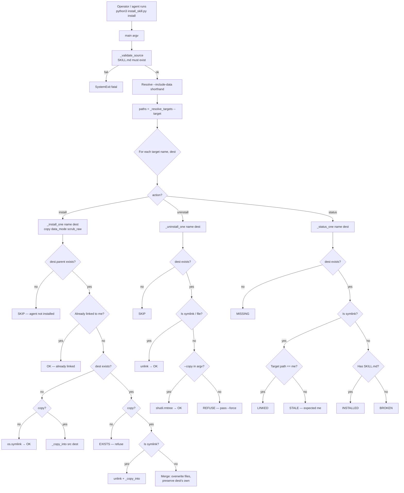

# Fund Install Pipeline

> **Last updated:** 2026-06-02
> **Source of truth:** `fund-data/scripts/install_skill.py` (330
> lines, dependency-free), `fund-data/SKILL.md` (the
> manifest that gets installed), `fund-data/SKILLS.md` (the
> per-platform install layout), `fund-data/SKILLS.md`
> §"Refresh" and §"Status".
> **For:** Anyone — human or AI — who needs to understand how
> the `fund-data` skill lands in OpenClaw / Codex / Claude
> Code / a personal `~/.agents` directory, and what
> `install_skill.py install | uninstall | status` actually
> does. The companion to
> [`fund-mcp-server-pipeline.md`](./fund-mcp-server-pipeline.md)
> (which is the runtime surface after install) and
> [`fund-cloud-bundle-pipeline.md`](./fund-cloud-bundle-pipeline.md)
> (which is the data plane the install wires up).

The installer is the **distribution boundary** of `fund-data`:
it is how a single source tree (`fund-data/SKILL.md` and
companion files) becomes a working skill in four different
agent platforms, each with its own discovery mechanism. This
document covers the three actions (`install` / `uninstall` /
`status`), the five install targets, the two install modes
(symlink / copy), the two data modes (none / copy), the
`--scrub-raw-responses` privacy flag, and the failure modes
the team has had to design around.

---

## 1. End-to-end flow (Mermaid)



## 2. End-to-end flow (ASCII fallback)

```
┌──────────────────────────────────────────────────────────────┐
│  Operator:                                                    │
│    python3 fund-data/scripts/install_skill.py install         │
│      --target codex --copy --data-mode copy --scrub-raw      │
└────────────────────────┬─────────────────────────────────────┘
                         │
                         ▼
main(argv) — install_skill.py:233
──────────────────────────────────
  ① _validate_source(): SKILL.md must be at PROJECT_ROOT/SKILL.md
  ② --include-data shorthand → args.copy = True, args.data_mode = "copy"
  ③ warn if data_mode=copy and not scrub_raw_responses (IP leak risk)
  ④ paths = _resolve_targets(args.target):
        all    → {claude, codex, openclaw, agents}
        name   → just that one
  ⑤ for each (name, dest) in paths:
        if action == "install":   _install_one(name, dest, ...)
        if action == "uninstall": _uninstall_one(name, dest)
        if action == "status":    _status_one(name, dest)
  ⑥ return 0

_target_paths() — install_skill.py:41
──────────────────────────────────────
  claude   → ~/.claude/skills/fund-data
  codex    → ~/.codex/skills/fund-data
  openclaw → ~/.openclaw/skills/fund-data
  agents   → ~/.agents/skills/fund-data
  (all = all four)

_install_one(target, dest, copy, data_mode, scrub_raw) — install_skill.py:59
───────────────────────────────────────────────────────────────────────────
  if not dest.parent.exists():
    return "SKIP — agent not installed"   (the agent itself is not on PATH)
  if not copy and dest.is_symlink() and dest.resolve() == SKILL_DIR_FOR_TARGETS.resolve():
    return "OK — already linked"
  if dest.exists() or dest.is_symlink():
    if copy and dest.is_symlink():
      dest.unlink()
      _copy_into(...)
      return "OK — replaced symlink with copy"
    if copy:
      for child in SKILL_DIR_FOR_TARGETS.iterdir():
        _copy_into(child, dest / child.name, data_mode, scrub_raw)
      return "OK — merged"
    return "EXISTS — use --copy to refresh or remove and rerun"
  if copy:
    _copy_into(SKILL_DIR_FOR_TARGETS, dest, data_mode, scrub_raw)
    return "OK — copied"
  os.symlink(SKILL_DIR_FOR_TARGETS, dest)
  return "OK — symlinked"

_copy_into(src, dst, data_mode, scrub_raw) — install_skill.py:105
──────────────────────────────────────────────────────────────────
  if _should_skip_install_path(src, data_mode):
    if dst.is_symlink() or dst.is_file(): dst.unlink()
    elif dst.is_dir(): shutil.rmtree(dst)
    return
  if dst.is_symlink(): dst.unlink()
  if src.is_dir():
    dst.mkdir(parents=True, exist_ok=True)
    for child in src.iterdir():
      _copy_into(child, dst / child.name, data_mode, scrub_raw)
    for child in list(dst.iterdir()):
      if _should_skip_install_path(child, data_mode):
        if child.is_dir(): shutil.rmtree(child)
        else: child.unlink()
  else:
    if dst.is_dir(): shutil.rmtree(dst)
    if src.name == "fund_data.sqlite" and data_mode == "copy":
      _copy_sqlite_database(src, dst, scrub_raw=scrub_raw)
    else:
      shutil.copy2(src, dst)

_copy_sqlite_database(src, dst, scrub_raw) — install_skill.py:143
─────────────────────────────────────────────────────────────────
  source_uri = "file:src?mode=ro"
  with sqlite3.connect(source_uri) as source, sqlite3.connect(dst) as target:
    source.backup(target)         # consistent snapshot, includes WAL pages
  if scrub_raw:
    with sqlite3.connect(dst) as target:
      target.execute("DELETE FROM raw_responses")
      target.commit()

_should_skip_install_path(path, data_mode) — install_skill.py:170
──────────────────────────────────────────────────────────────────
  True if any part of path is in:
    .DS_Store, .ruff_cache, .pytest_cache, __pycache__,
    backfill_logs, raw_responses, sync_state,
    backfill_state.json, backfill_summary.json
  OR if name matches:
    *.pyc, *.pyo,
    *.sqlite-journal, *.sqlite-wal, *.sqlite-shm,
    *.sqlite (UNLESS data_mode=="copy" and name=="fund_data.sqlite")

_uninstall_one(target, dest) — install_skill.py:198
──────────────────────────────────────────────────
  if not dest.exists() and not dest.is_symlink(): return "SKIP"
  if dest.is_symlink() or dest.is_file():
    dest.unlink(); return "OK — removed"
  if "--copy" in sys.argv: shutil.rmtree(dest); return "OK — removed"
  return "REFUSE — pass --force to remove a real directory"

_status_one(target, dest) — install_skill.py:211
────────────────────────────────────────────────
  if not dest.exists() and not dest.is_symlink(): return "MISSING"
  if dest.is_symlink():
    if dest.resolve() == SKILL_DIR_FOR_TARGETS.resolve(): return "LINKED"
    return "STALE — expected me, got elsewhere"
  if (dest / "SKILL.md").is_file(): return "INSTALLED"
  return "BROKEN — exists but no SKILL.md"
```

---

## 3. The eight layers, in detail

### 3.1 The five install targets

`fund-data/scripts/install_skill.py:41-48`

The installer knows about four agent platforms, each with
its own discovery mechanism:

| Target | Path | Discovery | Install mode |
|---|---|---|---|
| `claude` | `~/.claude/skills/fund-data` | Claude Code scans `<project>/.claude/skills/*/SKILL.md` and `~/.claude/skills/*/SKILL.md` | symlink (auto-picks up local edits) |
| `codex` | `~/.codex/skills/fund-data` | Codex scans `~/.codex/skills/*/SKILL.md` at startup, uses YAML `description` to decide when to trigger | copy (refreshed by `install --copy`) |
| `openclaw` | `~/.openclaw/skills/fund-data` | OpenClaw scans six locations in priority order; `~/.openclaw/skills/fund-data` is the "managed" slot | symlink (auto-picks up local edits) |
| `agents` | `~/.agents/skills/fund-data` | OpenClaw's "personal" slot | symlink |
| `all` | all four | "one-shot install" | per-platform default |

`SKILL.md`'s frontmatter advertises the same set:

```yaml
name: fund-data
version: 0.2.0
description: ...
homepage: https://github.com/GoldAnTo/fund-data
tags: [fund, finance, eastmoney, akshare, investoday, sqlite, chinese-market, data-pipeline]
tools: [bash, read, edit, web_fetch, python]
```

A platform that does progressive disclosure (Claude) loads
only `name` + `description` into the system prompt; the body
loads on first match. A platform that does full-load (Codex
pre-load) reads the whole file. The `tools:` list is the
**honest contract** of which built-in tools the skill
expects to call — `bash` for the CLI, `read` / `edit` for
the manifest, `web_fetch` for online docs, `python` for the
Python library.

### 3.2 The two install modes

`fund-data/scripts/install_skill.py:98-102` (symlink),
`fund-data/scripts/install_skill.py:105-140` (copy)

**Symlink mode** is the default for `claude`, `openclaw`,
and `agents`. The installer creates
`os.symlink(SKILL_DIR_FOR_TARGETS, dest)`. The agent sees
the symlink and reads the files through it; any local edit
to the source tree is immediately visible to the agent. The
trade-off: some agents follow symlinks transparently, some
do not; a symlink that points at a renamed or moved repo
becomes a `STALE` install.

**Copy mode** is required for `codex` (the team's choice —
see `SKILLS.md` §"Refresh": "Codex uses a real copy,
refresh it after editing SKILL.md or scripts/"). The
installer walks `SKILL_DIR_FOR_TARGETS` recursively and
copies each file (or each subdirectory) to `dest`, with
`_should_skip_install_path` excluding the runtime
artifacts. The trade-off: the copy is a snapshot; local
edits to the source tree do not propagate. The fix is to
re-run `install --copy`.

`--copy` is the explicit override; the per-platform default
is the symlink for `claude` / `openclaw` / `agents` and
the copy for `codex` (driven by Codex's discovery
mechanism, not by an explicit per-target flag in the
script).

### 3.3 The two data modes

`fund-data/scripts/install_skill.py:170-195`
(`_should_skip_install_path`)

Data mode controls what happens to `data/fund_data.sqlite`
and the audit artifacts during a copy install:

| Mode | Effect on copy | Effect on symlink |
|---|---|---|
| `none` (default) | `data/fund_data.sqlite` is skipped (not copied); WAL/SHM sidecars, `backfill_logs/`, `backfill_state.json`, `backfill_summary.json`, `raw_responses/` are all skipped | The symlink target is the source tree, so the destination's `data/` is whatever the source has. The "skip" set does not apply to symlinks. |
| `copy` (`--include-data` shorthand) | `data/fund_data.sqlite` is copied using `_copy_sqlite_database` (consistent snapshot, includes WAL pages); all other data artifacts are still skipped | Same as above. `--include-data` only takes effect on a copy install. |

The rationale for the default: most installs do not need
the 5 GB SQLite. The agent can rebuild from the providers
or pull the cloud bundle. The install that *does* need the
SQLite (a portable install for an air-gapped machine) is
the explicit `--include-data` case.

### 3.4 The privacy flag: `--scrub-raw-responses`

`fund-data/scripts/install_skill.py:160-167, 286-297`

When `--include-data` is set, the installer copies
`fund_data.sqlite` with all 14 tables including
`raw_responses`. The `raw_responses` table stores the
**full upstream HTTP body** for every fetch call,
including any `X-Forwarded-For` or caller-IP headers that
the upstream proxy added. A portable install that ships to
a public OSS bucket, a colleague's laptop, or a CI artifact
is a publish — and the IP in the headers leaks.

`--scrub-raw-responses` is the opt-in fix. The
`_copy_sqlite_database` function, after the consistent
`source.backup(target)` completes, executes
`DELETE FROM raw_responses` on the destination. The
operator who passed the flag is explicitly opting in to
the privacy scrub.

The installer also prints a warning if `--data-mode copy`
is in effect without `--scrub-raw-responses`, pointing
the user to the IP-leak risk. The warning is in the
script's CLI help text and the source comment; the
`SECURITY.md` document at the repo root has the
operator-facing copy.

### 3.5 The skip list

`fund-data/scripts/install_skill.py:170-195`

The skip list is the union of:

- **Hidden / cache files**: `.DS_Store`, `.ruff_cache`,
  `.pytest_cache`, `__pycache__/`, `*.pyc`, `*.pyo`.
- **Runtime artifacts**: `backfill_logs/`, `raw_responses/`,
  `sync_state/`, `backfill_state.json`,
  `backfill_summary.json`.
- **SQLite sidecars**: `*.sqlite-journal`, `*.sqlite-wal`,
  `*.sqlite-shm`.
- **The SQLite file itself**, except when
  `data_mode == "copy" and name == "fund_data.sqlite"`.

`_should_skip_install_path` is called at two points in
`_copy_into`:

1. **Before copying** — if the source path is in the skip
   list, the destination is unlinked or `rmtree`'d
   instead of being copied.
2. **After copying** — any leftover skip-list path in
   the destination is unlinked or `rmtree`'d. This
   handles the case where a previous install (with a
   different skip list) left artifacts behind.

The two-pass call ensures the destination never carries
runtime artifacts, regardless of the source state.

### 3.6 Status semantics

`fund-data/scripts/install_skill.py:211-222`

Status reports one of five states per target:

| Status | Meaning | Operator action |
|---|---|---|
| `LINKED` | Symlink points at the source tree | None (happy path) |
| `INSTALLED` | Real directory with `SKILL.md` | Refresh by re-running `install --copy` (for Codex) or editing source (for symlink installs) |
| `STALE` | Symlink points somewhere other than the source tree | Repo was moved or renamed; remove and re-link |
| `MISSING` | No entry at the target path | Run `install` |
| `BROKEN` | Entry exists but has no `SKILL.md` | Remove manually and re-install |

The status is the operator's "is everything wired up?"
check. The CI workflow (`.github/workflows/lint.yml`) does
not gate on `install_skill.py status` (the install is a
per-machine step, not a CI step), but a fresh-checkout
script that ships with the project does call it.

### 3.7 The fresh / upgrade / downgrade flow

The installer's three actions compose the lifecycle:

- **Fresh install** — `install --target codex` on a
  machine that has never had the skill. The `codex`
  target does not exist, so the `dest.parent.exists()`
  check returns true (Codex is installed) but `dest`
  does not. The installer takes the "fresh install"
  branch and either symlinks or copies depending on the
  flag.
- **Upgrade** — `install --copy --target codex` on a
  machine that already has the skill at the previous
  version. The `dest.exists()` check returns true and
  the `dest` is a real directory. The installer takes
  the "merge" branch and overwrites files in place,
  preserving any agent-side state (e.g. logs, config).
- **Downgrade / replace** — `install --target codex` on
  a machine where `codex` is a symlink to a different
  repo. The `dest.is_symlink() and resolve() != me`
  check returns true; the default action (without
  `--copy`) is `EXISTS — use --copy to refresh`. The
  operator either passes `--copy` (which unlinks and
  re-copies) or removes the stale symlink manually and
  re-runs.
- **Uninstall** — `uninstall --target codex` on a
  symlink install removes the symlink. On a copy
  install without `--copy`, the installer refuses
  (`REFUSE — pass --force`); with `--copy`, it
  `rmtree`'s the directory.

### 3.8 The console script: `fund-install-skill`

`pyproject.toml:55` declares:

```toml
[project.scripts]
fund-install-skill = "scripts.install_skill:main"
```

A `pip install -e .` of the project installs
`fund-install-skill` on PATH. The console script is the
agent-friendly entry point; a CI runner that has
`fund-data` in its Python path can call
`fund-install-skill install --target codex` without
specifying the script path.

---

## 4. Decision points an agent should know

| Question | Default | Override | What changes |
|---|---|---|---|
| Which targets? | `all` (claude / codex / openclaw / agents) | `--target codex` | Only the named target is touched. |
| Symlink or copy? | Per-target default (symlink for claude/openclaw/agents, copy for codex) | `--copy` | Forces copy for all targets. |
| Include the SQLite? | No (`data/fund_data.sqlite` is excluded) | `--include-data` (shorthand for `--copy --data-mode copy`) | Copies the SQLite via consistent backup. |
| Scrub `raw_responses`? | No (warning is printed) | `--scrub-raw-responses` | DELETE FROM raw_responses on the destination. |
| What about `raw_responses/`? | Skipped by the artifact list | (no override) | Always excluded from copy installs. |
| What about `backfill_state.json`? | Skipped | (no override) | Always excluded — the operator's state does not transfer. |
| `uninstall` of a real directory? | Refused (REFUSE) | `uninstall --force` or `uninstall --copy` | The `--copy` arg is detected from `sys.argv`; the installer treats it as "I know this is a copy install, rmtree is safe". |
| Status of a missing target? | `MISSING` | (no override) | The parent dir not existing is treated as a separate `SKIP` from the install path. |

---

## 5. Common agent misuses

1. **Treating "agent not installed" as a failure.** The
   `dest.parent.exists()` check returns false when the
   agent itself (Claude / Codex / OpenClaw) is not on
   the machine. The installer reports `SKIP — agent not
   installed` and moves on. An agent that wants the
   install to fail loudly should pass `--target claude`
   (the one it knows is installed) instead of `all`.

2. **Forgetting that `uninstall` refuses on a copy
   install.** The `uninstall` action's safety check is
   `if "--copy" in sys.argv` — it looks for the literal
   `--copy` arg. An operator that calls
   `uninstall --target codex` (without `--copy`) on a
   real directory gets `REFUSE — pass --force`. The
   workaround is `uninstall --copy --target codex` (the
   `--copy` arg is the safety signal), or
   `uninstall --force --target codex` (the explicit
   override).

3. **Re-running `install` on a symlink install without
   `--copy` to "refresh" it.** The default action for an
   existing symlink that points at the source is
   `OK — already linked` (idempotent no-op). The
   symlink already points at the live source; the
   operator's local edits are already visible. `--copy`
   is for **copy** installs that need a refresh.

4. **Shipping a portable `--include-data` install
   without `--scrub-raw-responses`.** The IP-in-headers
   leak is real; the installer prints a warning but
   the operator may miss it. A portable install that
   leaves the build machine must pass
   `--scrub-raw-responses` explicitly. The team
   documents this in `SECURITY.md` and the CLI help
   text.

5. **Editing the symlink target directly.** The symlink
   is `~/.claude/skills/fund-data → /path/to/fund-data/`.
   Editing the target directory is editing the source
   tree; the next `git status` will show the edits. An
   agent that wants to test a local change should edit
   the source tree, not the symlink — the symlink is
   the source.

6. **Calling `status` on a freshly-installed Codex
   install and seeing `INSTALLED` instead of `LINKED`.**
   The Codex install is a copy (per the team's
   convention), so it is a real directory, not a
   symlink. `INSTALLED` is the correct status. An
   operator that wants a symlink on Codex should pass
   `--copy` (which forces copy) — there is no flag to
   force symlink, because Codex's discovery mechanism
   does not follow symlinks in all cases.

7. **Trusting the `STALE` message without re-pointing.**
   A `STALE` install has a symlink that resolves to
   something other than the source tree — usually
   because the repo was moved or renamed. The fix is
   to remove the stale symlink and re-run `install`;
   the installer does not auto-rewrite a stale
   symlink because the wrong target might be a
   different repo entirely.

8. **Hiding the `BROKEN` status.** A `BROKEN` install
   has an entry at the target path but no `SKILL.md`
   inside. This is rare but happens if the operator
   manually created a directory there. The fix is
   `rm -rf ~/.claude/skills/fund-data` and re-run
   `install`.

9. **Installing without checking the source tree
   state.** The installer does not check
   `git status`; a dirty source tree is installed as-
   is. An operator that wants a clean install should
   `git status` and `git stash` (or commit) before
   `install`.

10. **Forgetting the SKILL.md frontmatter `tools:`
    list.** The `tools:` list is the agent's contract
    for which built-in tools the skill expects. The
    installer's per-platform defaults assume `bash`,
    `read`, `edit`, `web_fetch`, `python`. A new
    skill that needs `web_search` (for example) must
    add it to the `tools:` list in `SKILL.md`; the
    installer does not validate the list.

---

## 6. Typical workflows

### 6.1 Developer — fresh install on a laptop with all four agents

```bash
cd /path/to/fundData
python3 fund-data/scripts/install_skill.py install
# or, equivalently, the console script:
fund-install-skill install
```

Output:

```
fund-data install -> all
  source: /path/to/fundData/fund-data
  [claude]   OK   — symlinked .../fund-data
  [codex]    OK   — copied .../fund-data
  [openclaw] OK   — symlinked .../fund-data (parent did not exist → SKIP)
  [agents]   OK   — symlinked .../fund-data
```

A `SKIP` for `openclaw` means the OpenClaw binary is not
on PATH; install the OpenClaw agent and re-run.

### 6.2 CI runner — refresh the Codex install after editing SKILL.md

```bash
python3 fund-data/scripts/install_skill.py install --target codex --copy
```

The `--copy` forces a re-copy; the installer walks the
source tree and overwrites each file in the destination.
Runtime artifacts (`__pycache__`, `backfill_logs/`,
`raw_responses/`, SQLite sidecars) are skipped per the
artifact list.

### 6.3 Air-gapped install — portable snapshot with the SQLite

```bash
python3 fund-data/scripts/install_skill.py install --target codex \
  --copy --data-mode copy --scrub-raw-responses
```

The output: a copy of the skill plus a consistent
`fund_data.sqlite` snapshot (raw_responses emptied for
privacy). Ship the resulting `~/.codex/skills/fund-data/`
directory to the air-gapped machine.

### 6.4 Audit — what is installed where?

```bash
python3 fund-data/scripts/install_skill.py status
```

Output:

```
fund-data status -> all
  source: /path/to/fundData/fund-data
  [claude]   LINKED  — /home/me/.claude/skills/fund-data -> /path/to/fundData/fund-data
  [codex]    INSTALLED — /home/me/.codex/skills/fund-data (real directory)
  [openclaw] MISSING — /home/me/.openclaw/skills/fund-data
  [agents]   LINKED  — /home/me/.agents/skills/fund-data -> /path/to/fundData/fund-data
```

### 6.5 Uninstall — clean removal

```bash
# Symlink installs: rmtree is safe
python3 fund-data/scripts/install_skill.py uninstall --target claude

# Copy installs: pass --copy to opt in to rmtree
python3 fund-data/scripts/install_skill.py uninstall --target codex --copy

# Or use --force for a real directory without --copy
python3 fund-data/scripts/install_skill.py uninstall --target codex --force
```

---

## 7. Known gaps

Tracked in [`README.md` §Known gaps](../../README.md#known-gaps-tracked-for-030):

- **No `--dry-run` on `install`.** The installer
  writes to the filesystem on every action. An agent
  that wants to preview what would happen should run
  `status` first (it is read-only) and reason about
  the next action.
- **No `--link` flag to force symlink on Codex.** The
  Codex install is always a copy because Codex's
  discovery does not follow symlinks in all cases.
  The team has not found a reason to add an override;
  if a use case emerges, the flag would be `--link`
  and would skip the `_copy_into` walk.
- **No bulk refresh for symlink installs.** The
  symlink already points at the source; there is
  nothing to refresh. The installer reports
  `OK — already linked` and exits. An agent that
  wants to "force a re-link" (e.g. after a repo
  move) should `uninstall` and `install` separately.
- **No `list` action.** The five targets are hard-
  coded; an agent that wants the canonical list
  should read the source (`_target_paths` returns the
  dict).
- **The console script `fund-install-skill` is only
  installed by `pip install -e .`.** A developer
  who runs the script directly does not need the
  console script; a CI runner that does
  `pip install` of the wheel gets the script for
  free.

Other items:

- **`os.symlink` on Windows requires admin
  privileges.** The script does not handle this
  case; on a Windows machine without admin rights,
  the symlink install for `claude` / `openclaw` /
  `agents` will fail with `OSError`. The workaround
  is `--copy` for all targets, or to run the
  installer from an elevated shell.
- **`shutil.rmtree` on a copy install's `uninstall`
  does not check for a foreign skill with the same
  name.** The `--copy` arg is the safety signal, but
  if the destination was a copy of a different skill
  (operator error), `rmtree` will delete it. The
  `--force` flag is the alternative; neither is
  foolproof against operator error.

---

## 8. Code anchors (cheat-sheet)

| Step | File:line |
|---|---|
| `SKILL_NAME` / `PROJECT_ROOT` | `fund-data/scripts/install_skill.py:25-26` |
| `SKILL_DIR_FOR_TARGETS` | `fund-data/scripts/install_skill.py:32` |
| `_target_paths` | `fund-data/scripts/install_skill.py:41` |
| `_validate_source` | `fund-data/scripts/install_skill.py:51` |
| `_install_one` | `fund-data/scripts/install_skill.py:59` |
| `_copy_into` | `fund-data/scripts/install_skill.py:105` |
| `_copy_sqlite_database` | `fund-data/scripts/install_skill.py:143` |
| `_should_skip_install_path` | `fund-data/scripts/install_skill.py:170` |
| `_uninstall_one` | `fund-data/scripts/install_skill.py:198` |
| `_status_one` | `fund-data/scripts/install_skill.py:211` |
| `_resolve_targets` | `fund-data/scripts/install_skill.py:224` |
| `main` | `fund-data/scripts/install_skill.py:233` |
| `console_scripts` entry | `pyproject.toml:55` |
| `SKILL.md` manifest | `fund-data/SKILL.md` |
| Per-platform install layout | `fund-data/SKILLS.md` |
| Cloud data cache | `fund-data/SKILLS.md` §"Cloud data cache" |
| Refresh flow | `fund-data/SKILLS.md` §"Refresh" |
| Status semantics | `fund-data/SKILLS.md` §"Status" |
| How each platform discovers the skill | `fund-data/SKILLS.md` §"How each platform discovers the skill" |
| Privacy warning text | `fund-data/SKILLS.md`, `SECURITY.md` |

---

## 9. Maintenance

When you change any of the following, this document is stale:

- A new install target is added (a fifth agent
  platform) → update §3.1, §4, and the related
  playbook.
- The skip list changes (a new artifact added or
  removed) → update §3.5.
- The status semantics change (a new status added) →
  update §3.6 and the related playbook.
- The privacy flag is renamed or the warning text
  changes → update §3.4 and the related playbook.
- A new CLI flag is added (e.g. `--link` to force
  symlink) → update §4 and §7.

Open a PR with the diagram update alongside the code
change. The Mermaid block is the contract; the ASCII
block is the verification target. If they disagree,
ASCII wins.
