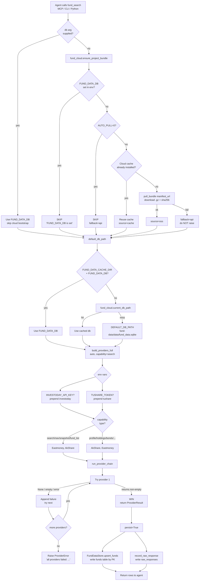

# Fund Lookup Pipeline

> **Last updated:** 2026-06-02
> **Source of truth:** `fund-data/scripts/fund_data.py`,
> `fund-data/scripts/fund_cloud.py`, `fund-data/scripts/fund_mcp.py`
> **For:** OpenClaw / Codex / Claude Code agents and the humans who
> wire them up. The companion to
> [`fund-data/SKILL.md`](../../fund-data/SKILL.md).

When an agent calls `fund_search("沪深300")`, the call passes through
**four layers** before returning rows:

1. **Entry-point** — MCP tool, CLI subcommand, or Python import.
2. **Cloud bootstrap** — decide which SQLite to read from / write to.
3. **DB path resolution** — collapse the env vars and cache into one
   concrete file path.
4. **Provider chain** — pick the live data source, run it, persist
   the result.

The diagrams below walk the layers in order, with code anchors and
the env vars that change behaviour at each step.

---

## 1. End-to-end flow (Mermaid)



## 2. End-to-end flow (ASCII fallback)

```
┌──────────────────────────────────────────────────────────────┐
│  Agent: fund_search("沪深300")                                │
│  (MCP tool / CLI subcommand / Python import)                  │
└────────────────────────┬─────────────────────────────────────┘
                         │
                         ▼
            db arg supplied?
            ├── yes ─► use FUND_DATA_DB, skip bootstrap
            └── no  ─► fund_cloud.ensure_project_bundle()
                              │
                              ├─ FUND_DATA_DB set?   → SKIP
                              ├─ AUTO_PULL=0?        → SKIP, fallback=api
                              ├─ Cache installed?    → reuse (source=cache)
                              └─ else pull_bundle(manifest_url)
                                    ├─ ok   → source=oss
                                    └─ fail → fallback=api (do NOT raise)
                         │
                         ▼
            default_db_path() — env vars + cache + fallback
            ├─ FUND_DATA_CACHE_DIR + FUND_DATA_DB → use FUND_DATA_DB
            ├─ fund_cloud.current_db_path()       → use cache
            └─ else                               → DEFAULT_DB_PATH
                         │
                         ▼
            build_providers_full("auto", capability=...)
            ├─ INVESTODAY_API_KEY?  → prepend investoday
            ├─ TUSHARE_TOKEN?        → prepend tushare
            └─ capability decides trailing order:
                 search/nav/snapshot/fund_list → [Eastmoney, AkShare]
                 profile/holdings/.../managers → [AkShare, Eastmoney]
                         │
                         ▼
            run_provider_chain(providers, "search_funds", kw)
            for p in providers:
              try: rows = p.search_funds(kw)
              except: log failure, continue
              if rows is None or empty: failure, continue
              return ProviderResult(p.name, rows, failures)
            raise ProviderError("all providers failed: ...")
                         │
                         ▼
            persist=True (default):
              FundDataStore.upsert_funds(rows)   — by fund_code PK
              record_raw_response(source, kw, raw)
                         │
                         ▼
            return [{fund_code, fund_name, fund_type, ...}, ...]
```

---

## 3. The four layers, in detail

### 3.1 Entry point

`fund-data` exposes three interchangeable surfaces that converge on
`fund_data.search_funds()`:

| Surface | Code | What it does |
|---|---|---|
| MCP stdio | `fund-data/scripts/fund_mcp.py:99` | Tool `fund_search` with full `inputSchema`. Returns `content[].text` (JSON) + `structuredContent` + `isError`. |
| CLI | `fund-data/scripts/fund_cli.py` (console script `fund-cli`) | `fund-cli search 沪深300`. Pretty-prints rows for humans. **No `--json` global flag in 0.2.0** — see [Known gaps](#7-known-gaps). |
| Python | `fund-data/scripts/fund_data.py:2748` | `fund_data.search_funds(keyword, db_path=..., provider=...)`. Returns list of dicts. |

The MCP entry calls `_maybe_bootstrap_cloud(arguments)` before
dispatching the tool. If the agent did not pass `db` in the tool
arguments, the bootstrap runs; otherwise it is skipped and the
explicit `db` is honoured verbatim.

### 3.2 Cloud bootstrap — `fund_cloud.ensure_project_bundle()`

`fund-data/scripts/fund_cloud.py:543-609`

A 5-step gate that decides whether to install the OSS query bundle:

1. **`FUND_DATA_DB` set and no cache override** → return immediately
   with `skipped: "FUND_DATA_DB is set"`. The agent's explicit
   database wins.
2. **`FUND_DATA_AUTO_PULL=0`** → return with
   `fallback: "api"`. Live providers will be used; no OSS touch.
3. **Cloud cache already installed** (`~/.cache/fund-data/current.json`
   points at a `fund_data_query.sqlite`) → return
   `source: "cache"`, no network call.
4. **Otherwise** → `pull_bundle(manifest_url)` downloads
   `fund_data_query.sqlite.gz` + `.sha256`, verifies the digest, and
   extracts to `~/.cache/fund-data/releases/<version>/`.
5. **Network failure** → catch *all* exceptions, return
   `fallback: "api"`. **The bootstrap never raises** so the live
   provider chain still has a chance to serve the request.

**The default manifest URL** is the project OSS bucket
(`fund-data-public-l` in `cn-shanghai`); override with
`FUND_DATA_MANIFEST_URL`.

### 3.3 DB path resolution — `fund_data.default_db_path()`

`fund-data/scripts/fund_data.py:32-61`

Narrow precedence list, in order:

| # | Source | Notes |
|---|---|---|
| 1 | `FUND_DATA_CACHE_DIR` + `FUND_DATA_DB` | Cache override AND explicit DB → DB wins |
| 2 | Bootstrap result's `db_path` | The OSS pull or cache reuse from §3.2 |
| 3 | `fund_cloud.current_db_path()` | `current.json` pointer, if it resolves |
| 4 | `DEFAULT_DB_PATH` | `fund-data/data/fund_data.sqlite` — local fallback |

If the bootstrap returned `fallback: "api"`, steps 2/3 may resolve
to "no cache" and the code falls through to step 4 (the on-disk
DB). This is the design contract: a failed OSS pull does not break
local lookups.

### 3.4 Provider chain — `build_providers_full` + `run_provider_chain`

`fund-data/scripts/fund_data.py:1955-2011` (chain building)
`fund-data/scripts/fund_data.py:609-623` (chain execution)

#### Chain composition (auto mode)

```
names = []

if INVESTODAY_API_KEY:        names.append(investoday)   # paid, top
if TUSHARE_TOKEN:              names.append(tushare)      # paid, second

if capability in {
    "stock_holdings", "profile", "bond_holdings",
    "industry_allocations", "fee_structures", "dividends",
    "splits", "fund_managers",
}:
    names.extend([akshare, eastmoney])                   # AkShare-first
else:
    # search, nav_history, snapshot, fund_list
    names.extend([eastmoney, akshare])                   # Eastmoney-first
```

In non-auto mode (`--provider eastmoney`, etc.) the list contains
exactly one name. If that single provider fails to initialise, the
error is raised immediately — no fallback.

#### Chain execution

```
failures = []
for p in providers:
    try:
        rows = p.search_funds(kw)        # or fund_list, nav_history, ...
        if rows is None or (rows == [] and not allow_empty):
            raise ProviderError("provider returned no rows")
        return ProviderResult(p.name, rows, failures)
    except Exception as exc:
        failures.append({provider: p.name, error: str(exc)})

raise ProviderError(f"all providers failed for search_funds: ...")
```

- **First non-empty rows wins.** A provider that returns `[]` is
  treated the same as a hard exception — keep trying.
- **`allow_empty=True`** is reserved for callers that consider "no
  matches" a legitimate answer; `search_funds` does not set it.
- **Failure text** concatenates every attempt:
  `"eastmoney: timeout; akshare: not installed"`.

### 3.5 Persistence (the side effect)

`fund-data/scripts/fund_data.py:2772-2776`

`search_funds` always upserts (unless `persist=False`):

- `FundDataStore.upsert_funds(rows)` — `INSERT OR REPLACE` keyed on
  `fund_code`. **All columns are overwritten** by the provider's
  payload. See [`fund-data/AGENTS.md`](../../fund-data/AGENTS.md)
  for the `refresh_fund_type` gotcha.
- `store.record_raw_response(source, keyword, raw)` — append-only
  audit log. The `raw_text` blob is a JSON dump of `{provider,
  rows, failures}` and can be large; this is what gets scrubbed
  on `--include-data` installs.

---

## 4. Decision points an agent should know

| Question | Default | Override | What changes |
|---|---|---|---|
| Which SQLite do I read? | OSS cache (via bootstrap) | `FUND_DATA_DB=/abs/path/fund_data.sqlite` | Bootstrap is skipped; explicit DB is used verbatim. |
| Should I try OSS at all? | Yes | `FUND_DATA_AUTO_PULL=0` | Bootstrap returns `fallback=api`; live providers run. |
| Which OSS bucket? | `fund-data-public-l` | `FUND_DATA_MANIFEST_URL=https://...` | Used by `pull_bundle`. |
| Which provider first? | Eastmoney (free, no key) | `INVESTODAY_API_KEY=...` or `--provider investoday` | Inserted at chain head. |
| AkShare not installed? | Skipped, falls through to Eastmoney | `pip install akshare` into the venv that runs the script | The chain gains a slot. |
| Provider returns `[]`? | Treated as failure, next tried | (no override) | A provider that *successfully* returns no rows is not the same as a hard empty answer. |
| All providers fail? | `ProviderError` raised | Inspect via `result.failures` from a successful call (it carries the partial-failure trail) | Agents should catch and surface, not retry blindly. |

---

## 5. Common agent misuses

1. **Assuming `fund_search` hits the local DB.** It does not. Search
   always goes through the live provider chain. To read from the
   local DB, use `fund_export table=funds`, `coverage_report`, or
   direct SQL via `fund_data.FundDataStore.connect()`.

2. **Looping `fund_search` for batch lookups.** The 1-RPS rate limit
   on `FundDataClient` makes this slow. For more than ~20 codes,
   use `fund_list` (full universe) and filter client-side, or
   `fund_batch_sync` for the per-fund pipeline.

3. **Setting `FUND_DATA_DB` AND `FUND_DATA_AUTO_PULL=0` and expecting
   the cloud bundle.** `FUND_DATA_DB` wins; the bootstrap is
   skipped. If you want OSS + an explicit DB, you have to unset
   `FUND_DATA_AUTO_PULL` and unset `FUND_DATA_DB`, then let the
   bootstrap write the cache and read from it.

4. **Calling `fund_search` immediately after `fund_cli sync` and
   expecting the new row.** Sync writes to `funds` and other tables;
   search is upstream-only. Use `coverage --fund-code 110022` to
   confirm what is in the local DB.

5. **Hiding provider failures.** `ProviderError` carries the full
   `failures` trail in the message. An agent that catches and
   returns "no data" loses the audit signal. Surface the message.

6. **Trusting `fund_type` after a `fetch_fund_list` overwrite.**
   `upsert_funds` is a column-replace. If you previously populated
   `fund_type` via `refresh_fund_type` and then call
   `fetch_fund_list`, the Eastmoney `fundcode_search` will
   overwrite the better Investoday value on 86 % of rows. Always
   re-run `refresh_fund_type --only-empty` after a `list` rebuild
   — see [`fund-data/AGENTS.md`](../../fund-data/AGENTS.md).

---

## 6. Minimal gateway configs

### OpenClaw (`~/.openclaw/gateway.json`)

```json
{
  "mcpServers": {
    "fund-data": {
      "command": "/path/to/fundData/.venv-akshare/bin/python",
      "args": ["/path/to/fundData/fund-data/scripts/fund_mcp.py"],
      "env": {
        "FUND_DATA_AUTO_PULL": "1",
        "FUND_DATA_MANIFEST_URL": ""
      }
    }
  }
}
```

Use the system Python if you do not need AkShare (search / NAV /
snapshot / fund_list work without it):

```json
{
  "mcpServers": {
    "fund-data": {
      "command": "python3",
      "args": ["/path/to/fundData/fund-data/scripts/fund_mcp.py"]
    }
  }
}
```

### Codex (`~/.codex/config.toml`)

```toml
[mcp_servers.fund-data]
command = "/path/to/fundData/.venv-akshare/bin/python"
args = ["/path/to/fundData/fund-data/scripts/fund_mcp.py"]
```

Install the SKILL.md alongside so Codex can also use the bash
fallback:

```bash
python3 /path/to/fundData/fund-data/scripts/install_skill.py install --target codex --copy
```

### Claude Code (`~/.claude.json` or project `.mcp.json`)

```json
{
  "mcpServers": {
    "fund-data": {
      "command": "python3",
      "args": ["/path/to/fundData/fund-data/scripts/fund_mcp.py"]
    }
  }
}
```

---

## 7. Known gaps

Tracked in [`README.md` §Known gaps](../../README.md#known-gaps-tracked-for-030):

- **No global `--json` flag on `fund_cli.py`.** Doctor, cloud, and
  install subcommands emit JSON; `list / search / nav / snapshot /
  profile` still pretty-print for humans. The MCP surface is the
  agent's JSON path; the CLI is for shell loops and humans.
- **No HTTP / SSE MCP transport.** Stdio only. A Streamable HTTP
  wrapper would unblock remote agent clients.
- **No `notifications/progress`** for `fund_batch_sync` — long
  pulls appear blank to the agent.
- **No `fund_doctor` / `fund_provider_status` MCP tool** — agents
  have to run `fund-cli doctor` in a separate shell to verify the
  environment.

---

## 8. Code anchors (cheat-sheet)

| Step | File:line |
|---|---|
| `fund_search` MCP tool definition | `fund-data/scripts/fund_mcp.py:99` |
| `_maybe_bootstrap_cloud` | `fund-data/scripts/fund_mcp.py:380` |
| `ensure_project_bundle` | `fund-data/scripts/fund_cloud.py:543` |
| `pull_bundle` | `fund-data/scripts/fund_cloud.py:201` |
| `default_db_path` | `fund-data/scripts/fund_data.py:32` |
| `search_funds` | `fund-data/scripts/fund_data.py:2748` |
| `fetch_fund_list` | `fund-data/scripts/fund_data.py:2779` |
| `build_providers_full` | `fund-data/scripts/fund_data.py:1955` |
| `run_provider_chain` | `fund-data/scripts/fund_data.py:609` |
| `FundDataStore.upsert_funds` | `fund-data/scripts/fund_data.py` (search inside the `FundDataStore` class around line 2014) |
| `FundDataClient` rate limit | `fund-data/scripts/fund_data.py:626` |

---

## 9. Maintenance

When you change any of the following, this document is stale:

- `default_db_path()` precedence (env vars / cache order)
- `ensure_project_bundle()` skip conditions or `fallback` semantics
- `build_providers_full()` capability routing
- `run_provider_chain()` empty-rows-vs-error policy
- New provider or capability added to the chain

Open a PR with the diagram update alongside the code change. The
Mermaid block is the contract; the ASCII block is the verification
target. If they disagree, ASCII wins.
