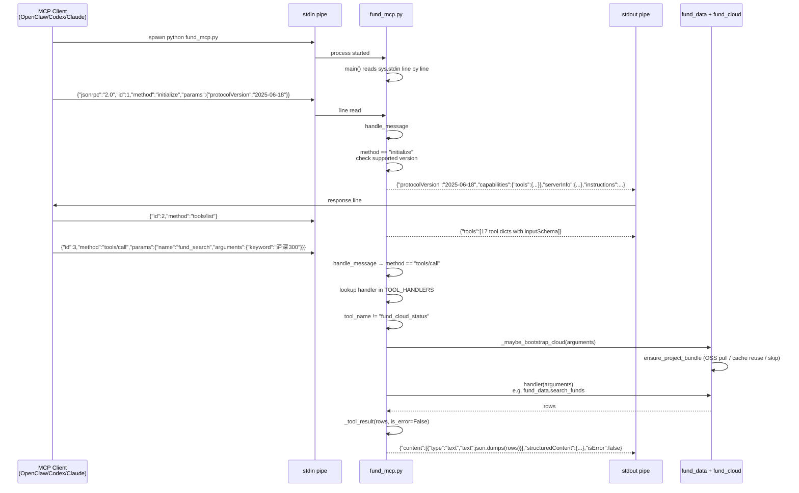

# Fund MCP Server Pipeline

> **Last updated:** 2026-06-02
> **Source of truth:** `fund-data/scripts/fund_mcp.py` (663 lines,
> dependency-free), the
> [MCP specification](https://modelcontextprotocol.io/specification)
> for the protocol contract.
> **For:** Anyone — human or AI — who needs to understand how the
> `fund-data` skill exposes itself to OpenClaw / Codex / Claude
> Code / any MCP-capable agent. Companion to
> [`fund-lookup-pipeline.md`](./fund-lookup-pipeline.md) (what
> happens *inside* a tool call) and
> [`fund-search-playbook.md`](./fund-search-playbook.md) (how to
> answer "what does this tool do?").

The MCP server is the **agent-facing surface** of `fund-data`.
It wraps the Python library (the same one the CLI calls) as a
JSON-RPC 2.0 service over stdin/stdout, with no dependencies
beyond the Python standard library. An agent that can speak MCP
gets the full data plane without shelling out to `fund-cli`.

This document covers:

1. The transport — what bytes go over the wire, and in what
   format.
2. The protocol — the four methods the server actually answers.
3. The tool catalogue — the 17 tools, their inputSchema, and
   which ones trigger the cloud bootstrap.
4. The result envelope — the `content` / `structuredContent` /
   `isError` triple every tool returns.

---

## 1. End-to-end flow (Mermaid)



## 2. End-to-end flow (ASCII fallback)

```
MCP client spawns:
  python3 /path/to/fund-data/scripts/fund_mcp.py

  stdin  ← JSON-RPC 2.0 requests, one per line
  stdout → JSON-RPC 2.0 responses, one per line
  stderr → human-readable logs (if any)

Per-message lifecycle (server side):
─────────────────────────────────────
for line in sys.stdin:
  if not line.strip(): continue
  try: message = json.loads(line)
  except JSONDecodeError:
    write JSONRPC_PARSE_ERROR to stdout, continue
  if not isinstance(message, dict):
    write JSONRPC_INVALID_REQUEST to stdout, continue
  response = handle_message(message)
  if response is not None: write response to stdout

handle_message(message):
  request_id = message["id"]   (None → notification, no response)
  method = message["method"]
  params = message["params"] or {}

  switch on method:
    "initialize":
      requested = params.get("protocolVersion") or DEFAULT
      version = requested if supported else DEFAULT
      return {protocolVersion, capabilities, serverInfo, instructions}

    "ping":
      return {}

    "tools/list":
      return {tools: TOOLS}    (17 dicts with name, description, inputSchema)

    "tools/call":
      tool_name = params.get("name")
      if not str → INVALID_PARAMS
      handler = TOOL_HANDLERS[tool_name]
      if not found → METHOD_NOT_FOUND
      try:
        arguments = params.get("arguments") or {}
        if tool_name != "fund_cloud_status":
          _maybe_bootstrap_cloud(arguments)   # OSS pull / cache
        payload = handler(arguments)
      except (TypeError, ValueError) as e:
        return JSON error INVALID_PARAMS, message=str(e)
      except Exception as e:
        # Tool error surfaces as a tool result, not a JSON-RPC error
        return response with isError=True, content=json.dumps({error: str(e)})
      return response with isError=False, content=json.dumps(payload),
                                  structuredContent=structured

    other:
      return JSON error METHOD_NOT_FOUND

JSON-RPC error codes:
  -32700 JSONRPC_PARSE_ERROR
  -32600 JSONRPC_INVALID_REQUEST
  -32601 JSONRPC_METHOD_NOT_FOUND
  -32602 JSONRPC_INVALID_PARAMS
  -32603 JSONRPC_INTERNAL_ERROR
```

---

## 3. The four layers, in detail

### 3.1 Transport — stdio newline-delimited JSON-RPC 2.0

`fund-data/scripts/fund_mcp.py:644-659`

The server is a **single-process, single-threaded** line loop on
`sys.stdin`. It does not fork, does not pool, does not run a
daemon. The contract is:

- **One JSON object per line.** No length-prefix framing, no
  HTTP, no WebSocket. Stdin and stdout are byte streams; the
  line is the message boundary.
- **Responses are also one per line.** The client matches
  request `id` to response `id` to know which response answers
  which request.
- **Notifications (no `id` field) get no response.** They are
  fire-and-forget; the server returns `None` from
  `handle_message` and writes nothing.
- **Stderr is free for logs.** The server does not print
  anything to stdout that is not a valid JSON-RPC response.
  Anything that does print to stdout from the application
  (e.g. an accidental `print()`) breaks every MCP client
  immediately.

`main()` returns 0 when stdin closes (EOF). The client is
expected to spawn the server as a subprocess and shut it down
by closing its stdin or sending SIGTERM.

### 3.2 Protocol — the four methods

`fund-data/scripts/fund_mcp.py:582-636`

| Method | Direction | Returns | Notes |
|---|---|---|---|
| `initialize` | request → response | `{protocolVersion, capabilities, serverInfo, instructions}` | The single most important call. The client sends this first; without it, no tools are available. |
| `ping` | request → response | `{}` | Optional health check. The server always answers `{}`. |
| `tools/list` | request → response | `{tools: TOOLS}` | 17 tool dicts, each with `name`, `description`, and `inputSchema`. |
| `tools/call` | request → response | `{content, structuredContent, isError}` | The actual data call. The workhorse. |

**The server does not implement** `resources/list`,
`resources/read`, `prompts/list`, `prompts/get`, or
`notifications/*` (e.g. `notifications/cancelled`,
`notifications/progress`). The `capabilities` field in
`initialize` is explicitly `{"tools": {"listChanged": false}}` —
a client that asks for resources gets nothing.

**Notifications from the client** (e.g. `notifications/initialized`,
`notifications/cancelled`) are accepted silently — `handle_message`
returns `None` for any message without an `id`, so no response is
written. The server does not act on them.

**Protocol version negotiation** (`fund_mcp.py:594-597`):

```
requested = str(params.get("protocolVersion") or DEFAULT_PROTOCOL_VERSION)
version = requested if requested in SUPPORTED_PROTOCOL_VERSIONS else DEFAULT
```

The server advertises support for four protocol versions:
`2024-11-05`, `2025-03-26`, `2025-06-18`, `2025-11-25`. If the
client asks for a version outside that set, the server falls
back to `2025-06-18` (the most recent one most clients
implement). The client should respect the returned
`protocolVersion` for subsequent calls.

### 3.3 Tool catalogue — the 17 tools

`fund-data/scripts/fund_mcp.py:98-299`

Every tool is declared as a dict with the same shape:

```python
{
    "name": "fund_search",
    "description": "Search Chinese public funds by ...",
    "inputSchema": {
        "type": "object",
        "properties": {...},
        "required": [...],
        "additionalProperties": False,
    },
}
```

`additionalProperties: False` means the server rejects tool
calls with unknown arguments with a `JSONRPC_INVALID_PARAMS`
error. An agent that passes an extra field will not get a
silent success.

The 17 tools, grouped by what they do:

**Discovery (3)**

| Tool | Args | What it does |
|---|---|---|
| `fund_search` | `keyword` (required), `db?`, `provider?`, `limit?` | Keyword search via the provider chain. Always writes to DB. |
| `fund_list` | `db?`, `provider?`, `limit?` | Full universe of 27k funds. |
| `fund_cloud_status` | `cache_dir?`, `manifest_url?` | Cache + manifest inspection. **Does not trigger bootstrap.** |

**Per-fund data (10)**

| Tool | Args | Capability |
|---|---|---|
| `fund_snapshot` | `code` (required) | Eastmoney `pingzhongdata` |
| `fund_nav_history` | `code` (required), `start_date?`, `end_date?`, `page?`, `per?` | Eastmoney `F10DataApi` |
| `fund_profile` | `code` (required) | AkShare / Tushare / Investoday |
| `fund_stock_holdings` | `code` (required), `report_year?` | AkShare `fund_portfolio_hold_em` |
| `fund_bond_holdings` | `code` (required), `report_year?` | AkShare `fund_portfolio_bond_hold_em` |
| `fund_industry_allocations` | `code` (required), `report_year?` | AkShare `fund_portfolio_industry_allocation_em` |
| `fund_fee_structures` | `code` (required), `indicators?` | AkShare + Eastmoney page fallback |
| `fund_dividends` | `code` (required) | AkShare `fund_open_fund_info_em` |
| `fund_splits` | `code` (required) | AkShare `fund_open_fund_info_em` |
| `fund_managers` | `code?` (optional) | AkShare `fund_manager_em` |

**Sync (2)**

| Tool | Args | What it does |
|---|---|---|
| `fund_sync` | `code` (required), `start_date?`, `end_date?`, `include_*?`, `report_year?`, `fee_indicators?` | Per-fund pipeline. See `fund-batch-sync-pipeline.md`. |
| `fund_batch_sync` | `codes` (required), `concurrency?`, `min_interval_seconds?`, `include_all?`, ... | Batch per-fund pipeline. Same. |

**Inspection (2)**

| Tool | Args | What it does |
|---|---|---|
| `fund_coverage` | `db?`, `fund_code?` | One fund's per-dataset coverage rows. |
| `fund_coverage_report` | `db?`, `codes?`, `fund_type?`, `only_incomplete?`, `min_completeness?`, `limit?` | Multi-fund gap analysis. |
| `fund_export` | `db?`, `table` (required), `fund_code?`, `limit?` | Raw table dump for downstream tooling. |

**Common args** (present on most tools except `fund_cloud_status`):

- `db` — SQLite path override. If unset, triggers
  `_maybe_bootstrap_cloud` (see below).
- `provider` — `"auto"`, `"eastmoney"`, `"akshare"`,
  `"investoday"`, `"tushare"`. Default `"auto"`.

### 3.4 Result envelope — `content` + `structuredContent` + `isError`

`fund-data/scripts/fund_mcp.py:313-324` (`_tool_result`)

Every successful `tools/call` response has this triple:

```json
{
  "content": [
    {
      "type": "text",
      "text": "<JSON-serialised payload, ensure_ascii=False, indent=2>"
    }
  ],
  "structuredContent": {<typed payload>},
  "isError": false
}
```

- **`content[0].text`** is the human-readable JSON dump. MCP
  clients that only render text display this string. It is
  *always* JSON, regardless of whether the payload is a list,
  a dict, or a scalar.
- **`structuredContent`** is the machine-typed payload. For
  list payloads, it is `{"rows": [...], "count": N}`. For
  dict payloads, it is the dict itself. Clients that respect
  the MCP spec can read this directly without re-parsing the
  text.
- **`isError`** is the success/failure flag. `true` means the
  tool raised; the `text` field carries `{"error": "<message>"}`.

Error responses come in **two shapes** — the difference
matters to clients:

- **JSON-RPC error** (`{"jsonrpc":"2.0","id":N,"error":{...}}`)
  for protocol-level problems: unknown method, parse error,
  missing `params.name`, type mismatch on arguments, etc. The
  client should treat these as "the call did not happen" and
  may retry.
- **Tool result with `isError: true`** for application errors:
  the provider chain raised, the SQLite write failed, the
  network was down. The client should treat these as "the call
  happened and failed" — retrying is the application's
  decision, not the protocol's.

The code:

```python
except (TypeError, ValueError) as exc:
    return _json_error(request_id, JSONRPC_INVALID_PARAMS, str(exc))
except Exception as exc:  # noqa: BLE001
    return _json_response(request_id, _tool_result({"error": str(exc)}, is_error=True))
```

- `TypeError` / `ValueError` → JSON-RPC `INVALID_PARAMS`
  (these are usually the tool's own argument validation, e.g.
  "missing required argument: keyword").
- Anything else → tool result `isError: true` (these are
  application errors: provider chain, SQLite, etc.).

---

## 4. The cloud bootstrap on the MCP path

`fund-data/scripts/fund_mcp.py:380-383, 627-628`

For every tool call except `fund_cloud_status`, the server
calls `_maybe_bootstrap_cloud(arguments)` before the tool
handler. The function:

```python
def _maybe_bootstrap_cloud(arguments: dict[str, Any]) -> None:
    if _optional_str(arguments, "db"):
        return
    fund_cloud.ensure_project_bundle()
```

**If the agent passed `db` in the tool arguments, the
bootstrap is skipped** — the explicit path wins. Otherwise,
the bootstrap runs. The bootstrap never raises; it returns
`fallback: "api"` on network failure. The tool call proceeds
either way.

The exception is `fund_cloud_status`, which is the **only
tool that does not trigger the bootstrap**. The reason: that
tool *is* the bootstrap introspection. Triggering the
bootstrap to answer a question about the bootstrap would be
circular. An agent that wants to inspect the cache state
before any other call should call `fund_cloud_status` first.

See [`fund-lookup-pipeline.md` §3.2](./fund-lookup-pipeline.md#32-cloud-bootstrap--fund_cloudensure_project_bundle)
for the full bootstrap lifecycle.

---

## 5. Decision points an agent should know

| Question | Default | Override | What changes |
|---|---|---|---|
| What protocol version? | `2025-06-18` | Send `initialize` with the client's preferred version | Server falls back to default if the version is unsupported. |
| Which DB? | `default_db_path()` (OSS cache or local) | `db="/abs/path/fund_data.sqlite"` argument on the tool call | Bootstrap is skipped. |
| Which provider? | `auto` (Eastmoney first for the cheap four, AkShare first for the deep eight; paid prepended) | `provider="eastmoney"` etc. | The provider chain is restricted to that one provider; missing it raises. |
| How do I report errors? | Tool result with `isError: true` for application errors; JSON-RPC error for protocol errors | (no override) | Clients must distinguish the two shapes. |
| How do I avoid the cloud bootstrap? | Pass `db` on every call | `FUND_DATA_AUTO_PULL=0` (skips even when `db` is unset) | The first is per-call; the second is process-wide. |
| Can I get progress notifications? | No | (no override) | The server is stdio-only and synchronous. Long calls appear blank. |
| Can I stream large results? | No | `limit` argument (capped) | Lists are returned whole; reduce `limit` for large tables. |
| Where are the resources / prompts? | Not implemented | (no override) | `capabilities.tools.listChanged = false` is the explicit signal. |
| Why no `fund_doctor` / `fund_provider_status`? | Not implemented (v0.3.0 backlog) | Run `fund-cli doctor` in a separate shell | Until the tool lands, agent self-diagnosis is shell-out. |
| Why no JSON-RPC over HTTP? | Stdio only (v0.3.0 backlog) | (no override) | Remote agents must run the server in-process. |

---

## 6. Common agent misuses

1. **Printing to stdout from a tool handler.** Breaks every
   MCP client immediately. The server asserts the
   "stdout is JSON-RPC only" contract in its design; an
   upstream contributor adding a `print()` debug will silently
   break the OpenClaw integration.

2. **Forgetting the `initialize` call.** Without it, the
   server has no record of the client's protocol version and
   the agent has not received the `capabilities` / `serverInfo`
   / `instructions` it needs. Some clients are forgiving
   (they send `tools/list` without `initialize` and the server
   answers); some are not (they refuse to call tools without
   `initialize` first). The spec says `initialize` is required
   first.

3. **Confusing `isError` with a JSON-RPC error.** A tool
   result with `isError: true` is *not* a JSON-RPC error — it
   is a successful call that returned an error payload.
   A client that maps `isError: true` to a JSON-RPC retry
   will get into an infinite loop, because the retry will
   produce the same error.

4. **Not respecting `additionalProperties: false`.** Sending
   a tool call with an extra argument field triggers
   `JSONRPC_INVALID_PARAMS` because the input validation
   rejects it. The client should map that to "my argument
   shape is wrong", not "the server is broken".

5. **Reading `content[0].text` and ignoring
   `structuredContent`.** The text is human-readable JSON; the
   structuredContent is the typed payload. A client that only
   reads the text gets the right answer but pays the JSON
   parse cost; a client that reads both gets the typed
   payload for free.

6. **Calling `fund_cloud_status` and expecting a bootstrap
   trigger.** It does not trigger the bootstrap. An agent
   that wants to *see* the bootstrap effect should call any
   other tool (`fund_search` is the cheapest) and then
   `fund_cloud_status` to inspect the state.

7. **Running the server without `set -e`-style strict mode
   in the launcher.** A launcher that pipes a Bash error to
   stdout (e.g. `python3 -c "..."` that prints traceback)
   pollutes the JSON-RPC stream. Use a launcher that captures
   stderr to a log file.

8. **Starting the server with an `IFS` / `LANG` environment
   that changes JSON encoding.** The server uses
   `ensure_ascii=False`, so non-ASCII characters (e.g. fund
   names in Chinese) are emitted as-is. A client that assumes
   ASCII will misparse. The contract is UTF-8.

---

## 7. A minimal client reference

A 30-line Python reference client (for testing the server
without OpenClaw):

```python
import json
import subprocess

proc = subprocess.Popen(
    ["python3", "/path/to/fund-data/scripts/fund_mcp.py"],
    stdin=subprocess.PIPE, stdout=subprocess.PIPE,
    text=True, bufsize=1,
)

def call(method, params=None, id=None):
    msg = {"jsonrpc": "2.0", "method": method}
    if id is not None: msg["id"] = id
    if params is not None: msg["params"] = params
    proc.stdin.write(json.dumps(msg) + "\n")
    proc.stdin.flush()
    return json.loads(proc.stdout.readline())

# Step 1: initialize
print(call("initialize", {"protocolVersion": "2025-06-18"}, id=1))

# Step 2: list tools
print(call("tools/list", id=2))

# Step 3: search
print(call("tools/call", {
    "name": "fund_search",
    "arguments": {"keyword": "沪深300", "limit": 5},
}, id=3))

# Step 4: clean shutdown
proc.stdin.close()
proc.wait()
```

---

## 8. Known gaps

Tracked in [`README.md` §Known gaps](../../README.md#known-gaps-tracked-for-030):

- **No HTTP / SSE MCP transport.** Stdio only. A Streamable
  HTTP wrapper would unblock remote agent clients.
- **No `notifications/progress`.** Long `fund_batch_sync`
  calls appear blank to the agent; the MCP server is
  synchronous and returns only on completion.
- **No `resources/list` / `resources/read`.** The server does
  not implement the resource part of the spec. An agent that
  wants `fund://funds/110022` URIs has to wrap `fund_export`
  in a custom client.
- **No `prompts/list` / `prompts/get`.** The server does not
  ship prompt templates. An agent that wants a
  "fund-comparison" prompt has to bundle it client-side.
- **No `fund_doctor` / `fund_provider_status` tool.**
  Self-diagnosis is shell-out (`fund-cli doctor`).
- **No `tools/list` change notifications.** `listChanged` is
  `false`; the tool set is fixed for the life of the process.

---

## 9. Code anchors (cheat-sheet)

| Step | File:line |
|---|---|
| `SERVER_NAME` / `SERVER_VERSION` | `fund-data/scripts/fund_mcp.py:26-27` |
| `DEFAULT_PROTOCOL_VERSION` / `SUPPORTED_PROTOCOL_VERSIONS` | `fund-data/scripts/fund_mcp.py:28-34` |
| JSON-RPC error code constants | `fund-data/scripts/fund_mcp.py:36-40` |
| `_tool` / schema builders | `fund-data/scripts/fund_mcp.py:69-85` |
| `COMMON_ARGS` | `fund-data/scripts/fund_mcp.py:88-95` |
| `TOOLS` (17 tool dicts) | `fund-data/scripts/fund_mcp.py:98-299` |
| `_json_response` / `_json_error` | `fund-data/scripts/fund_mcp.py:302-310` |
| `_tool_result` (envelope) | `fund-data/scripts/fund_mcp.py:313-324` |
| `_args` / `_required_str` / `_optional_*` | `fund-data/scripts/fund_mcp.py:327-369` |
| `_db` / `_provider` | `fund-data/scripts/fund_mcp.py:372-377` |
| `_maybe_bootstrap_cloud` | `fund-data/scripts/fund_mcp.py:380-383` |
| `_call_fund_*` (per-tool dispatch) | `fund-data/scripts/fund_mcp.py:391-557` |
| `TOOL_HANDLERS` (17 entries) | `fund-data/scripts/fund_mcp.py:560-579` |
| `handle_message` (method dispatch) | `fund-data/scripts/fund_mcp.py:582-636` |
| `_write_message` (stdout + flush) | `fund-data/scripts/fund_mcp.py:639-641` |
| `main` (line loop) | `fund-data/scripts/fund_mcp.py:644-659` |

---

## 10. Maintenance

When you change any of the following, this document is stale:

- A new tool is added to `TOOLS` → update §3.3 catalogue.
- A new MCP method is implemented (`resources/list`, etc.) →
  update §3.2 protocol table and §8 known gaps.
- A new error code is introduced → update §3.4 result envelope.
- The bootstrap behaviour on `fund_cloud_status` changes →
  update §4.
- Protocol version set changes → update §3.2.

Open a PR with the diagram update alongside the code change.
The Mermaid block is the contract; the ASCII block is the
verification target. If they disagree, ASCII wins.
